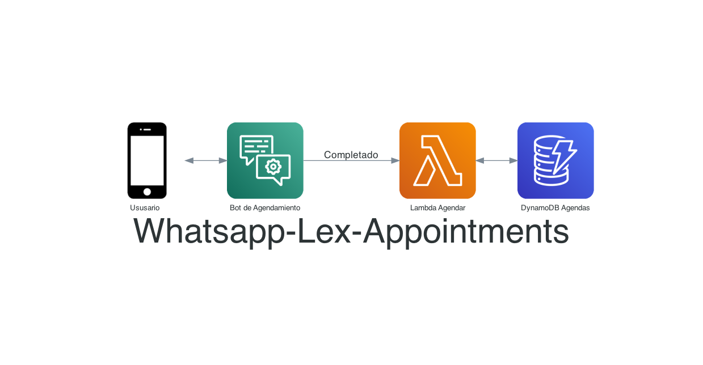

# Intro




---

## Instrucciones para despliegue

En este repositorio vamos a desplegar  una funcion lambda que recibe las solicitudes de agendas y las inserta en una base de datos.

Una aplicación real deberá validar lógicas de negocio por ejemplo: deberá validar que la agenda esté disponible o manejar también autorizaciones de pacientes validando el número telefónico por ejemplo. 

Además vamos a generar una cuenta Twilio y un Bot de Amazon Lex para recibir las solicitudes de agendamiento de clientes mediante Whatsapp.
___
## Paso 1: Backend de Agendamiento

```zsh 
git clone https://github.com/ensamblador/whatsapp-lex.git

```
Crear y activar un ambiente python virtual
(requiere virtualenv instalado)

```
cd whatsapp-lex
virtualenv -p python3 .env
source .env/bin/activate
```
Instalar los modulos de python necesarios
```
pip install -r requirements.txt
```
ver listado de aplicaciones (requiere cdk instalado https://docs.aws.amazon.com/cdk/latest/guide/cli.html )
```
cdk ls
```
*Nota: si no ha ejecutado CDK debará generar un boostrap con el comando `cdk bootstrap`*

desplegar la aplicacion backend (servicio de agendamiento Lambda-DynamoDB)

```
cdk deploy
```

use `cdk deploy --profile <profile-name>` en caso de que quiera desplegar con credenciales distintas al profile por defecto.

Limpiar eliminando la aplicacion 

```
cdk destroy
```

*Useful CDK commands*

 * `cdk ls`          list all stacks in the app
 * `cdk synth`       emits the synthesized CloudFormation template
 * `cdk deploy`      deploy this stack to your default AWS account/region
 * `cdk diff`        compare deployed stack with current state
 * `cdk docs`        open CDK documentation


___
##  Paso 2: Sandbox de Whatsapp Twilio

Genere una cuenta de twilio gratuita para acceder al Sandbox de Whatsapp 
https://www.youtube.com/watch?v=O2PB6o2E8aA

Una vez activado el sandbox deberá enrolar usuarios enviando un mensaje personalizado a el número de whatsapp provisto por twilio.


https://www.twilio.com/console/sms/whatsapp/sandbox

En este punto copie las __ACCOUNT SID__ y __AUTH TOKEN__ para ser utilizados en Amazon Lex.


https://www.twilio.com/console


##  Paso 3: Amazon Lex y Bot de Agendamiento 

En este paso combinamos todo, primero partimos generando un simple bot de agendamiento, puede ser el bot template o uno custom. No entraremos en detalles de como hacer un bot, dejamos una guía de como implementarlo en la consola de amazon lex https://docs.aws.amazon.com/es_es/lex/latest/dg/gs-bp-create-bot.html


Para el caso el bot deberá ser capaz de recopilar la información del usuario para la agenda:

* ​AppointmentType : Tipo de agenda de consulta médica.
* Date: Fecha de agenda de consulta médica
* Time: Horario de agenda de consulta médica


##  Paso 4: Integrar Backend de Agendamiento
Para eso debemos configurar Lex para que utilice la lambda generada en el paso 1


Después de esto haga click en __Build__ y luego __Publish__ para publicar el bot.

##  Paso 5 : Integrar con Twilio

Una vez publicdo el bot, en la pestaña channels -> Twilio SMS configuramos un nuevo canal utilizando Account SID y Auth Token de Twilio:


Esto nos generará un endpoint Url que vamos a copiar


Y lo pegamos en la url a llamar cuando llegue un mensaje:


Guardamos en twilio y ya está listo ahora probemos.

## Pruebas

Para probar el bot de agendamiento agregamos como contacto el número asignado por twilio y enviamos el mensaje de Opt-in, una vez enrolado ya estamos listos para utilizar:


Adicionalmente como parte del despliegue podemos acceder a la url que muestra las agendas realizads por whatsapp. 


Esta página se actualiza cada 10s y nos muestra las citas agendadas por Whatsapp.

