# Chatobot Amazon Lex y Whatsapp (Twilio): Guía paso a paso

# 1. Introduccion 

TO DO

## 1.1 Objetivo

En este Workshow vamos a implemntar un Chabot usando Amazon Lex y lo vamos a integrar con la plataforma de mensajería instantánea WhatsApp. Esta integración se realizará a través de la plataforma (twilio) que nos permitirá recibir mensajes directamente desde la aplicación whatsapp (web o smartphone).

Se trata de un caso de uso para el agenda miento de horas al dentista, no obstante puede extenderse para cualquier tipo de interacción Con un asistente virtual, por ejemplo preguntas y respuestas frecuentes, información del estado de un caso de soporte, solicitud de información personalizada, ejecución de un procesamiento automático, etc.

## 1.2 Arquitectura

Arquitectura está compuesta por un Chat Bot Lex configurado para interactuar con el usuario y resolver la información necesaria para el agendamiento (motivo,  hora y día). Una vez resuelta la información, se envía la solicitud a una función Lambda que procesa el requerimiento insertando la cita en la tabla DynamoDB (para este ejercicio no existe ninguna validación de negocio en la función Lambda, sólo inserta la cita).

Hacia el cliente la interacción se realiza a través de una integración con Twilio que permite enviar y recibir mensajes de WhatsApp hacia el Chatbot.

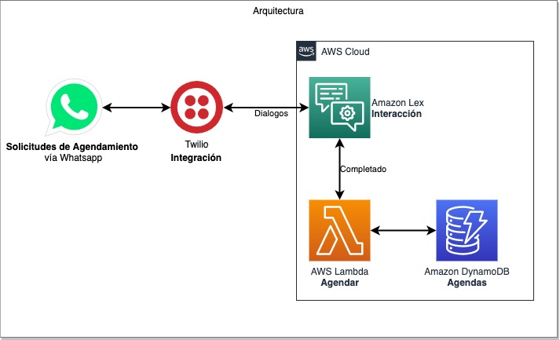

## 1.3 Costos

Los costos de la solución vienen dados por el uso de acuerdo a las transacciones realizadas:
* Amazon Lex: 0.004 USD por request de voz y 0.00075 USD por request de texto
* Lambda: [0.2 USD por Millón de solicitudes + 0.0000166667 USD por GB-segundo](https://aws.amazon.com/lambda/pricing/) 
* DynamoDB: 0.25 USD por GB (después de los 25 GB Gratuitos) + 1.25 USD por millon de unidades de escritura y 0.25 USD por millon de unidades de lectura

**Ejemplo:**

Supongamos el caso de nuestro Chat Bot intercambia 10 mensajes con el usuario para una agenda miento que realizamos 1000 conversaciones con 500 agendamientos al mes. Cada registro de agendamiento pesa 1 KB.

**Lex:** 
Mensajes  = 1000 x 10 = 10.000 
Costo  = 10000 x 0.00075 = 7,5 USD

**Lambda:**
Solicitudes: 500
Costo Invocaciones = 500 / 1.000.000 x 0.2 USD = 0.0001 USD
GB-Segundo = 500 x (100 milisegundos) x (256 MB)  =  500 x 0.1 x 0.25 = 12.5 GB-Segundo
Costo por GB-Segundo = 12.5 x 0.0000166667 USD = 0.0002 USD

**DynamoDB**
Unidades de Escritura: 500 x 1 KB / 1 KB= 500 WCU
Costo por escritura: 500 / 1.000.000 x 1.25 = 0.000625
Costo por almacenamiento: 500 KB / 1.000.000 x 0.25 = 0.000125 USD (adicional por cada mes)
Costo por escritura: Depende de la cantidad de lecturas. Si se lee 5 veces el costo es 0.000625 USD.

**Twilio**
Los costos de twilio deben ser revisados en https://www.twilio.com/whatsapp/pricing/us
Al momento de la redacción de esta guía los costos de twilio son 0.005 USD por mensaje.

___
# 2. Despliegue de la solución

## 2.1 Amazon Lex Chatbot (En español)

Amazon Lex es un servicio para crear interfaces de conversación con voz y texto. Ofrece las funcionalidades de deep learning como reconocimiento automático de voz para convertir voz en texto y tecnología de comprensión del lenguaje natural para reconocer la intención del texto. [Más información de Lex](https://aws.amazon.com/es/lex/)

Para crear un nuevo Chatbot vamos a la Consola de Lex en AWS (https://console.aws.amazon.com/lex).

Si no ve la consola de Amazon Lex, cambie a una las regiones soportadas 
https://docs.aws.amazon.com/general/latest/gr/lex.html 

* Si es la primera vez que utiliza Lex en esta región haga click en **Get Started**.
* Si ya cuenta con un bot, haga click en **Create** en el menú **Bots**

Para el proyecto utilizaremos el template de Schedule Appointment. En **Bot Name** utilizamos un nombre a elección. 

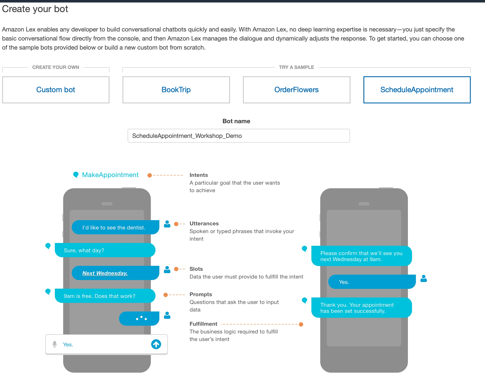

* Para **Language** elegimos Spanish (US) 
* **Sentiment analysis** No
* **COPPA** No

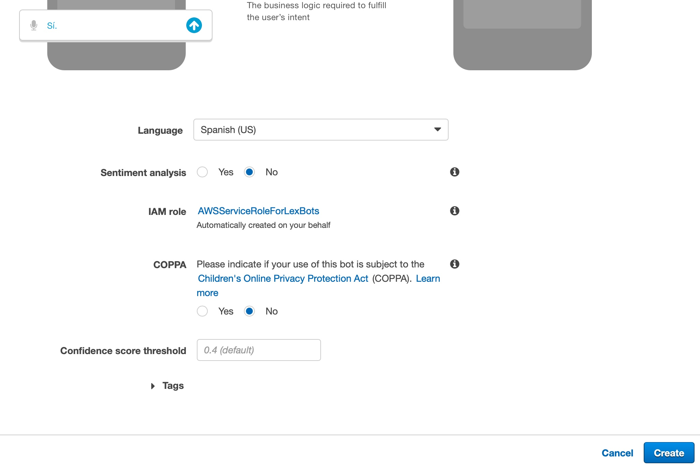

Una vez configurado hacemos click en **Create** 

Nuestro Bot Base está listo. 
___
## 2.2 Intents, Utterances y Slots.

Una vez que nuestro Bot está creado accedemos a él. Podemos ver en editor los **Intents** (Intenciones) es decir,  los distintos objetivos que puede buscar un usuario cuando contacta al bot (agendar, consultar agenda, cancelar agenda).

Los **Slot Types** son variables customizadas asociadas a la intención (pot ejemplo en este caso Tipo de Consulta). Es una información provista por el usuario. El bot llena estos slots en las conversaciones. Nota los Slots que aparecen acá son sólo los de tipo "custom slots". Amazon Lex provee **Slots** ya construidos como Fecha, Hora, Lugares. Un listado completo lo encuentra acá https://docs.aws.amazon.com/lex/latest/dg/howitworks-builtins-slots.html  

**Utterances** son las conversaciones que pueden activar la intención. Estas frases ya podrían incorporar uno o varios slots. 

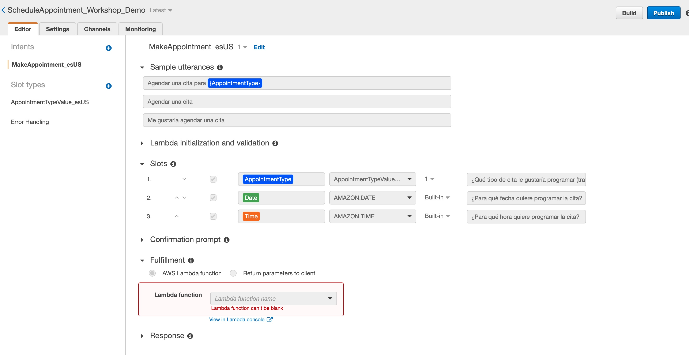

**Intent Slots** los slots que debe llenar el Bot en la conversación. Pueden ser custom o Nativos. El prompt es la frase con la que el bot consulta el intent.

Vemos que el template nos muestra un Intent por defecto llamado `MakeAppointment_esUS` vamos a editarlo (click en el botón edit al lado del nombre) y realizamos los siguientes cambios.

1. **En fulfillment indicamos que responda los parámetros al cliente.**
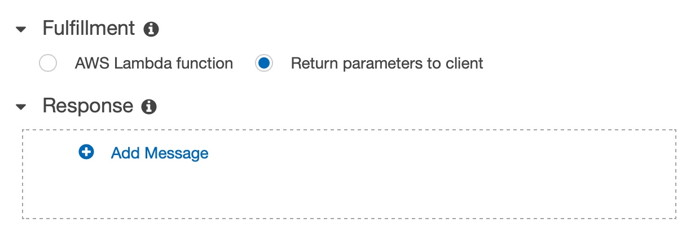
   
1. **En `Sample Utterances` agregaremos un par de frases que incluyan otros slots**
De esta forma permitimos que en un solo mensaje podamos capturar las tres variables (los slots se definen en la frase usando paréntesis `{}`)
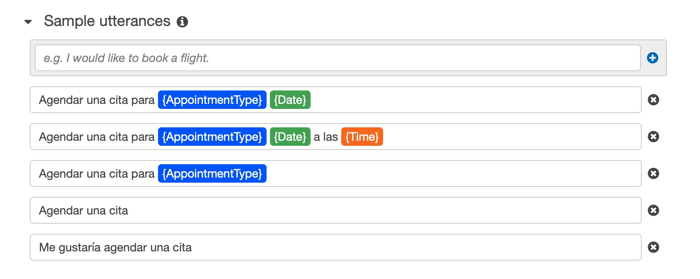
   

1. **En el Slot de de `AppointmentType`vamos a agregar un hint para que el usuario conozca las opciones de Citas**
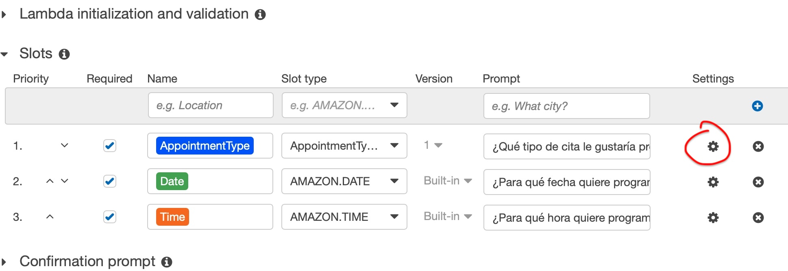
Agregamos en el prompt "(Tratamiento de condicto, Control, Limpieza)"
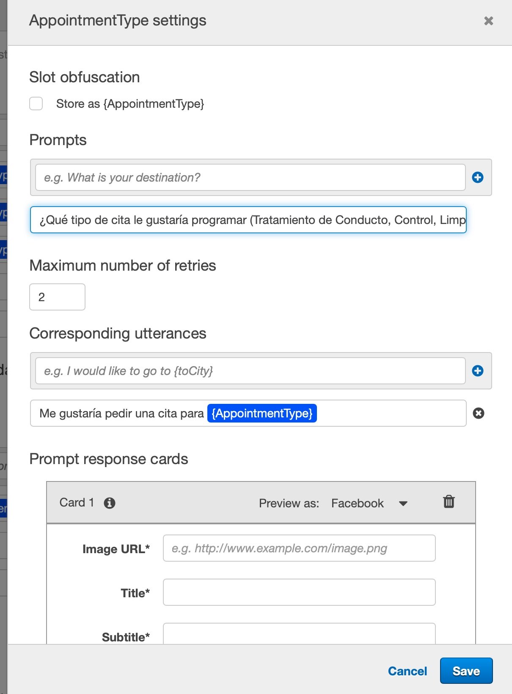
   
1. **Después de hacer estas modificaciones Guardamos nuestro Intent.**
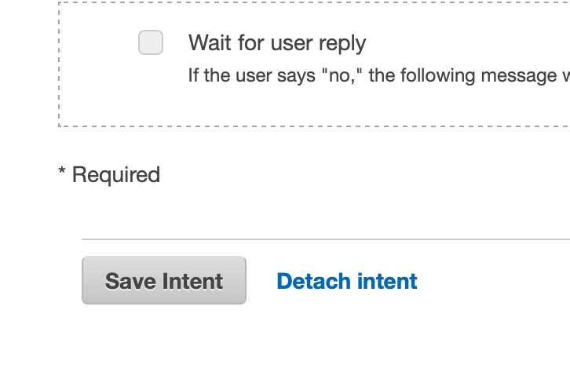

   
1. **Creamos Otro Intent que nos salude ante cualquier y oriente al usuario**
* En `Intents` le damos al signo (+) y luego `Create Intent`
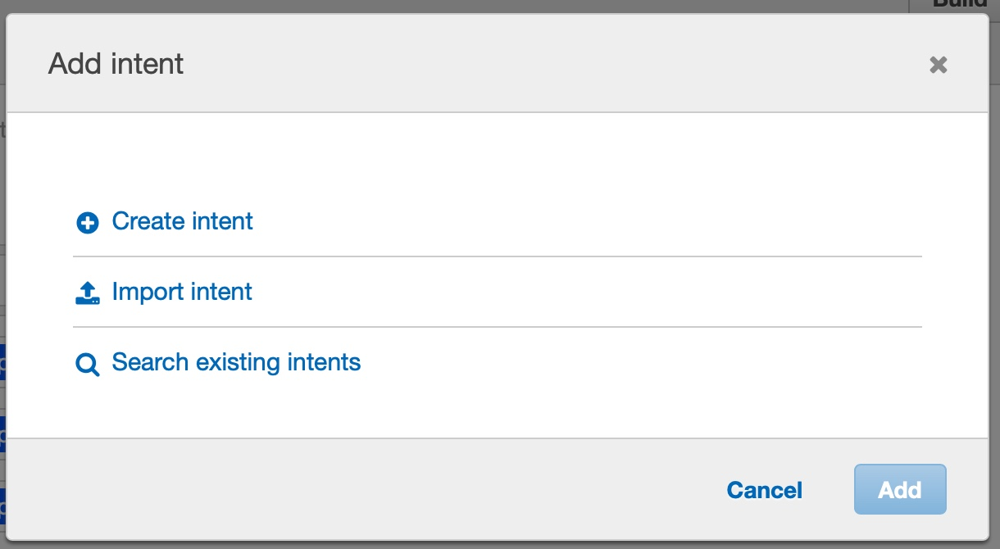
   
* Le damos un nombre y lo agregamos al bot.
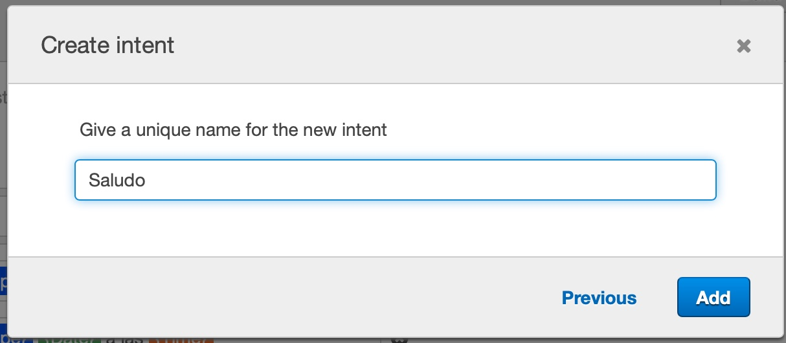
   
* Para que este intent se active vamos a configurar las siguientes frases en `Utterances`
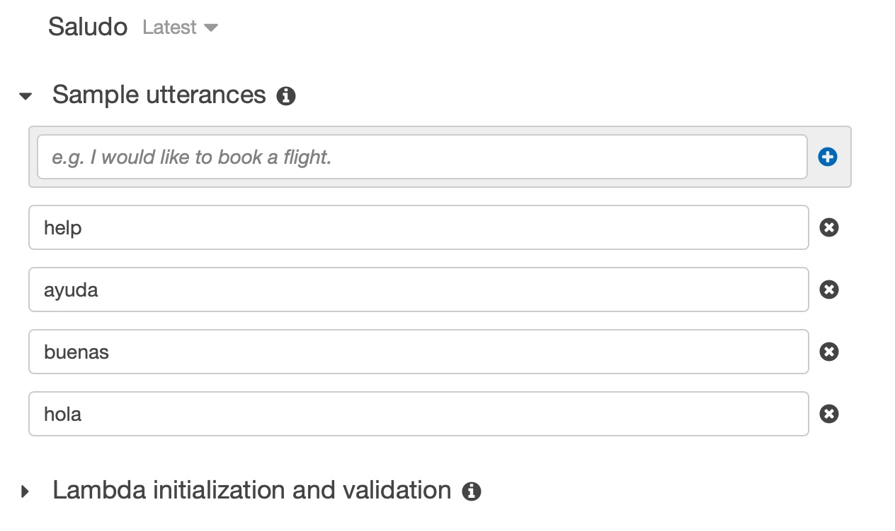
   
* Luego agregamos la respuesta que va a orientar a nuestro usuario a agendar.

    **_Hola. Yo te ayudaré a agendar una hora disponible de Dentista si me dices: "agendar una cita"_**

    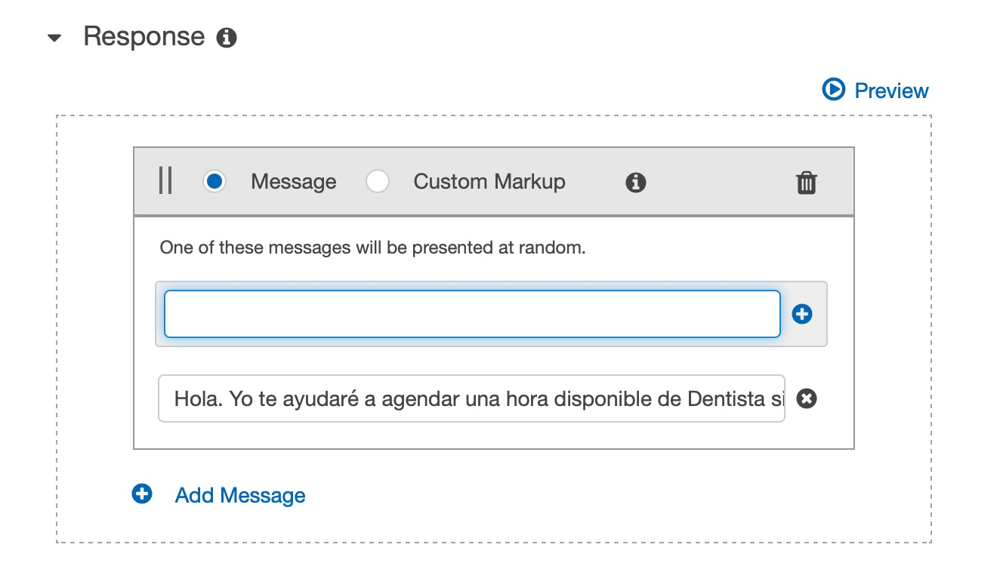

* Finalmente guardamos el nuevo intent y le damos al boton **Build**
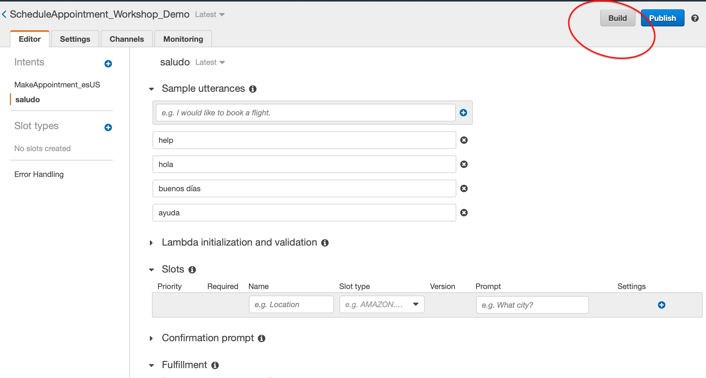

Listo! nuestro bot ya puede saludar y ahora vamos a probarlo en la consola.

___
## 2.3 Pruebas de Bot

Una vez que el bot está armado podemos acceder a la consola de pruebas, al lado derecho. Haga unas pruebas a ver si está respondiendo bien, en caso contrario revise los pasos anteriores nuevamente.

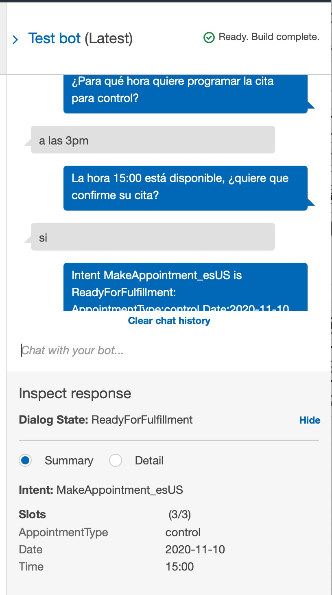

Cuando el Estado es `ReadyForFulFullment` significa que todos los Slots están completos y podemos proceder al agendamiento (no hemos llegado a eso aún, pero vamos ecaminados)

😎

### 2.2 La Base de Datos de Agendas

### 2.2 Función Lambda de Agendamiento
### 2.3 Cumplimiento (Fulfillment) de la Intención.
### 2.4 Pruebas de Bot agendando.

### 2.5 Agregar la interfaz web (front-end)

### 2.6 Utilizando Whatsapp
### 2.6.1 Crear una cuenta gratuita de Twilio
### 2.6.2 Twilio account SID y AUTH Token
### 2.6.3 Lex endopoint url de Twilio channel
### 2.6.5 Pruebas end to end.

### 2.7 Análisis de Sentimiento (opcional)

### 2.7 Visualización de los datos (opcional)

## 3 Limpieza

## 4 Material adicional