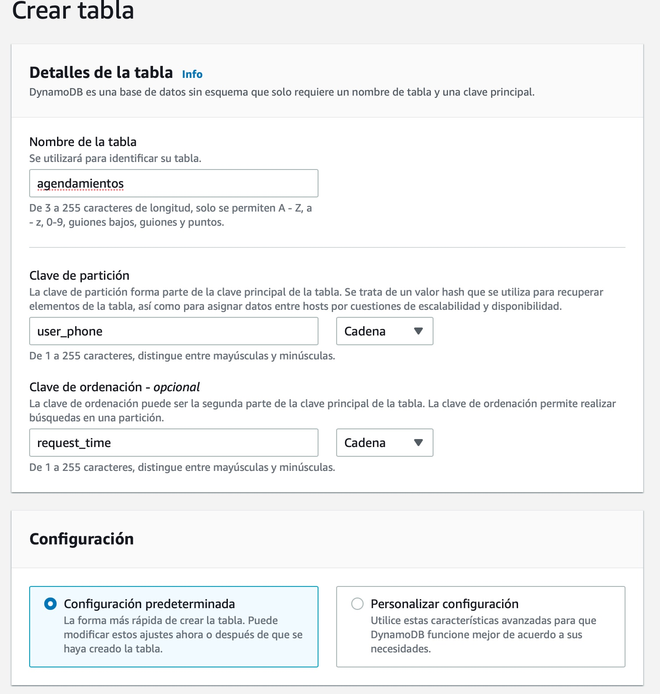

# La Base de Datos DynamoDB para Agendas

Amazon DynamoDB es un servicio de base de datos NoSQL totalmente administrado que ofrece un rendimiento rápido, confiable y escalable. Vamos a utilizar este servicio para crear una tabla donde almacenaremos las agendas. Como primer paso vamos a la [consola DynamoDB](http://console.aws.amazon.com/dynamodb)  y creamos una tabla. En el formulario de creación vamos a indicar

* Nombre de la Tabla: **agendamientos**
* Clave de Partición: **user_phone** tipo **String**
* Clave de Ordenación: **request_time** tipo **String**
* Configuración: **Configuración Predeterminada**

Luego de eso haga click en crear tabla. Sólo eso es necesario para crear una tabla 😀

Si quiere profundizar acerca de las claves de partición puede consultar en la [documentación de DynamoDB](https://docs.aws.amazon.com/es_es/amazondynamodb/latest/developerguide/bp-partition-key-design.html).

### **[Volver al proyecto ↩️ ](README.md)**