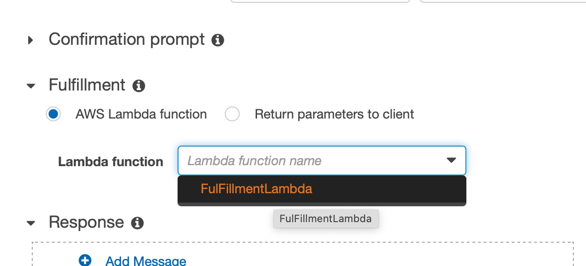
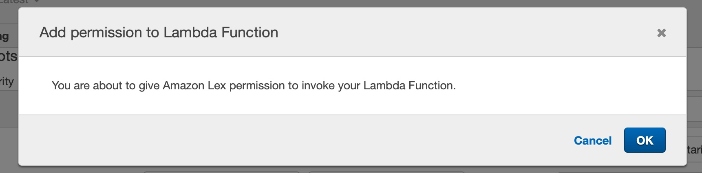
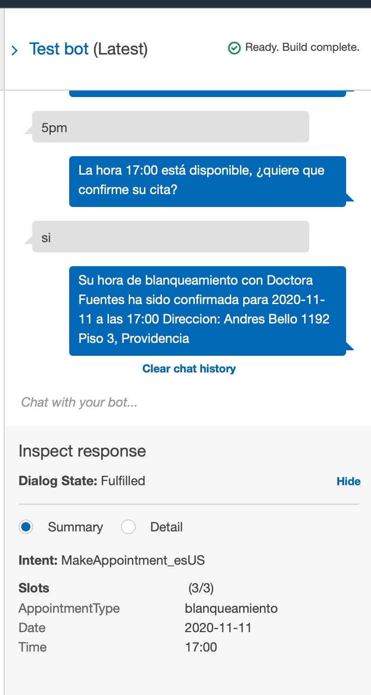
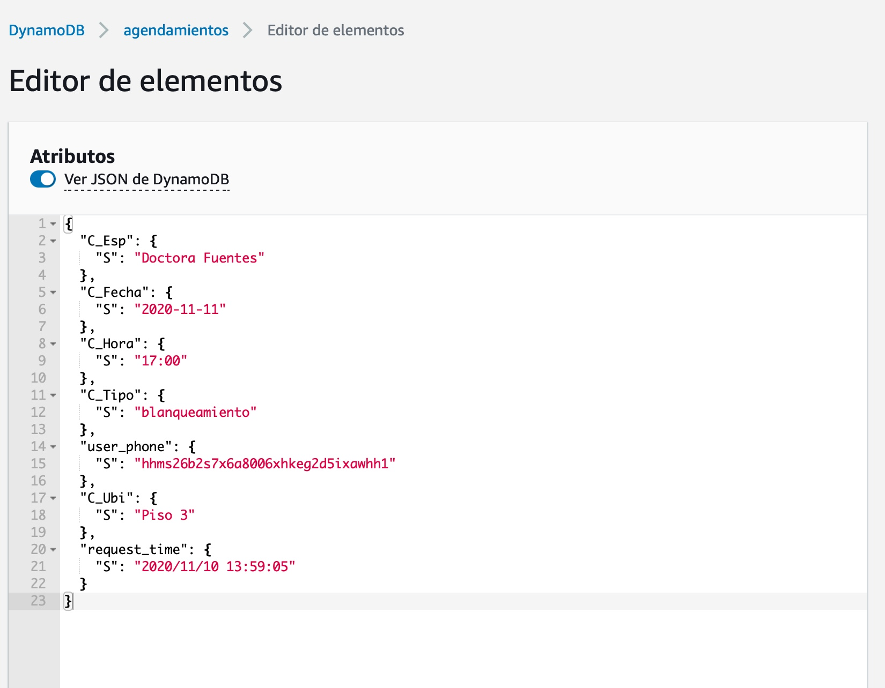

# Integración de Lex con la función Lambda

Antes de continuar, asegúrese de haber realizado los pasos anteriores y confirmar que todo funciona correctamente (pruebas del Bot de Lex y pruebas de la función Lambda). Ahora lo que haremos será enganchar nuestro Bot con la función al momento del Fulfillment del intent, para eso vamos a la Consola de Lex y editamos el intent.

En `Fulfillment` seleccionamos **AWS Lambda function** y su **alias**

Autorice a Lex para poder invocar la función.

Luego haga click en **Save Intent** y luego **Build**

Después que termine el **Build** verifique en la consola de prueba que el bot está agendando utilizando la función lambda. Si está correcto al final debería recibir un mensaje del estilo.

**`Su hora de blanqueamiento con Doctora Fuentes ha sido confirmada para 2020-11-11 a las 17:00 Direccion: Andres Bello 1192 Piso 3, Providencia`**

Por otro lado si va a revisar la Consola de DynamoDB y encontrará un nuevo registro correspondiente a esta cita:

Hemos terminado la integración con Lambda ahora podamos continuar con el proyecto.

### **[Volver al proyecto ↩️ ](README.md)**