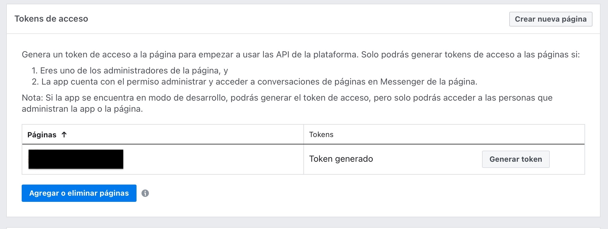
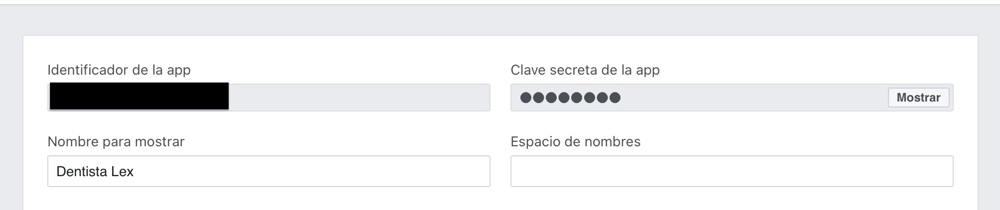
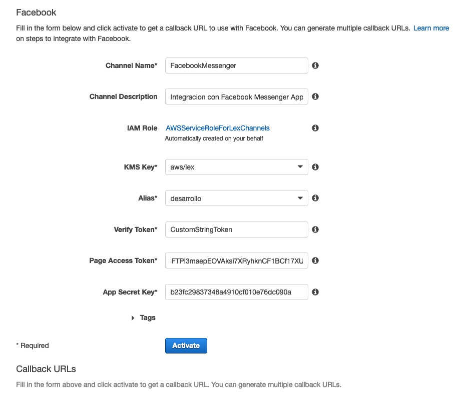
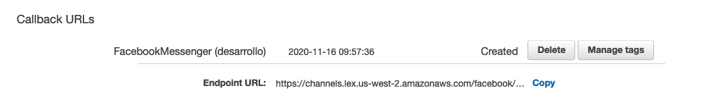
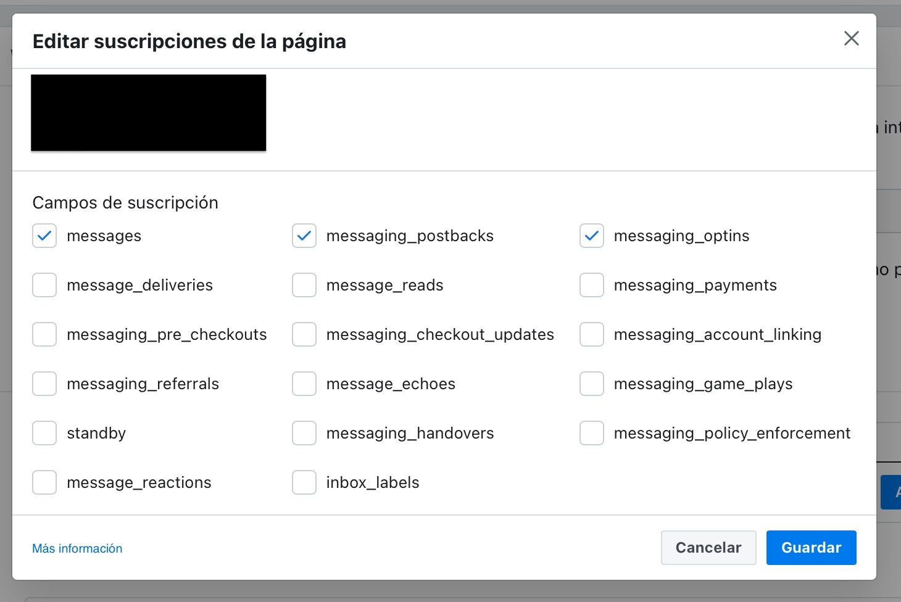
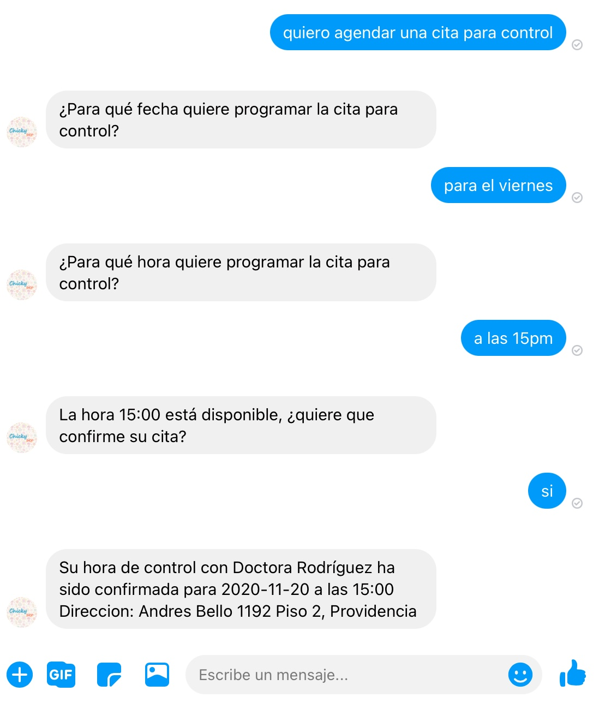

# Integración del Chatbot con Facebook Messenger 

Para integración con una aplicación de Facebook Messenger puede seguir [esta guía oficial](https://docs.aws.amazon.com/es_es/lex/latest/dg/fb-bot-association.html). A modo de resumen los pasos son los siguientes:

### Crear una Aplicación Facebook

[Cree una aplicación de Facebook y configúerela](https://developers.facebook.com/docs/messenger-platform/getting-started/app-setup) una vez finalizado debería tener acceso al **PAGE ACCESS TOKEN** y **APP SECRET KEY**

### En Lex crear una nuevo nueva integración con Facebook en Channels

Vaya a la consola lex, en la sección _Channels_ cree una nueva integración. Utilice **PAGE ACCESS TOKEN** y **APP SECRET KEY** para **VERIFY TOKEN** utilice su propio string.

Una vez activado, genera un **Endpoint URL**. Tome nota del él.

### Crear un Webhook en facebook para conversar con el Bot.

En la seccion de Messenger de la aplicación, agregue un webhook para comunicarse con el bot
use el **VERIFY TOKEN** que creó en integración de Lex.

Agregue una pagina que se suscribirá la app, para cada pagina autorizada configure el nivel de suscripción que tendrá la app. _messages_, _messaging_postback_ y _messaging_optins_

La integración está lista, ahora podemos probar el bot.

### Probando el bot desde una chat de messenger

### **[Volver al proyecto ↩️ ](README.md)**