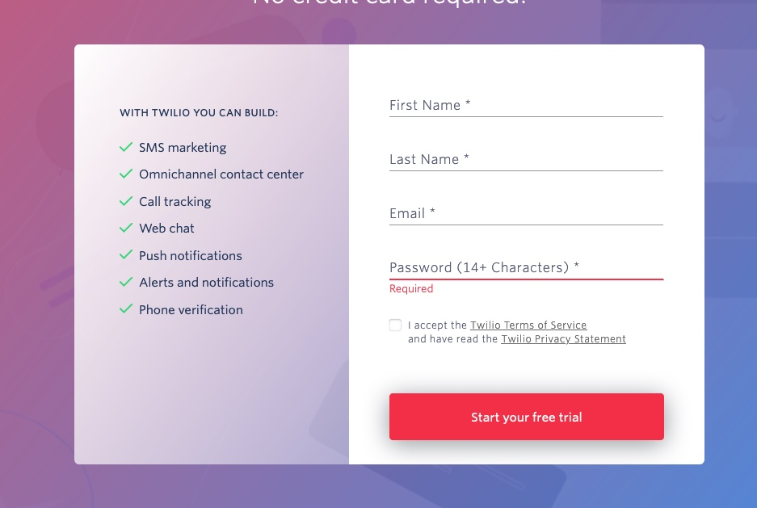
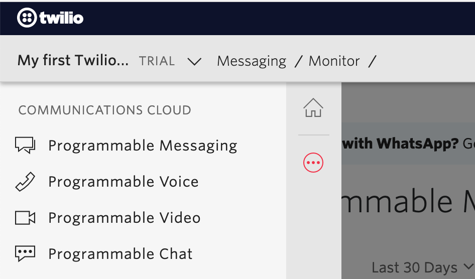
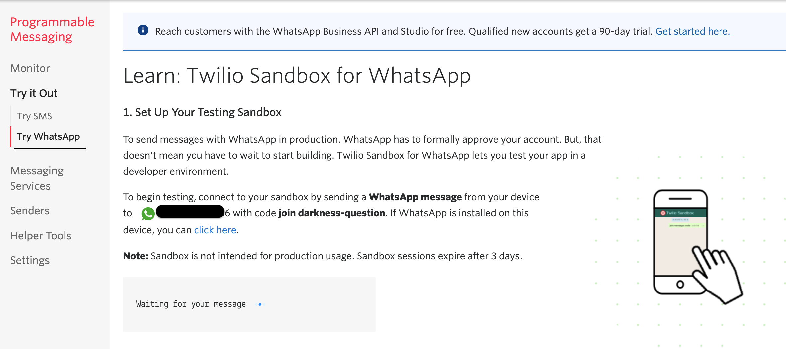
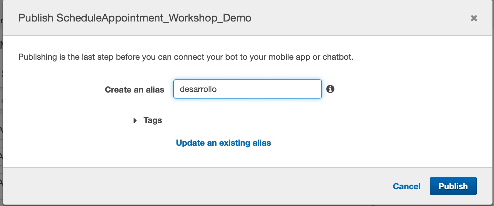
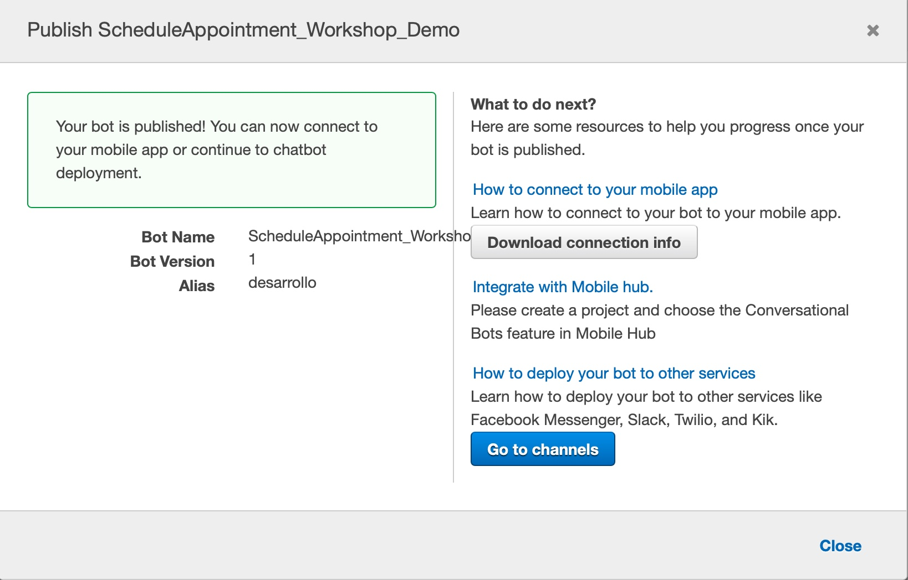
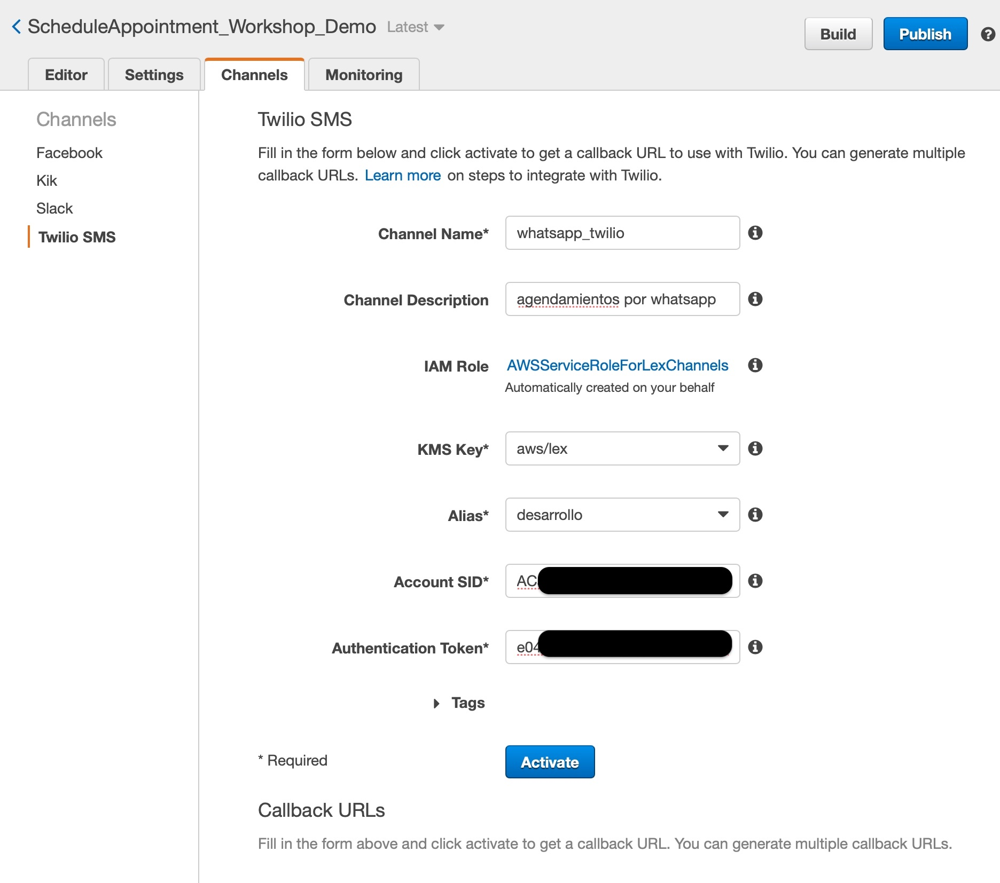
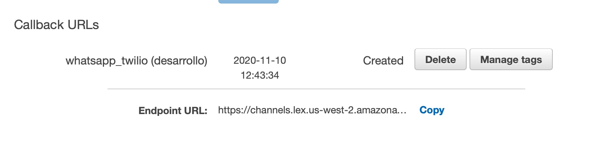
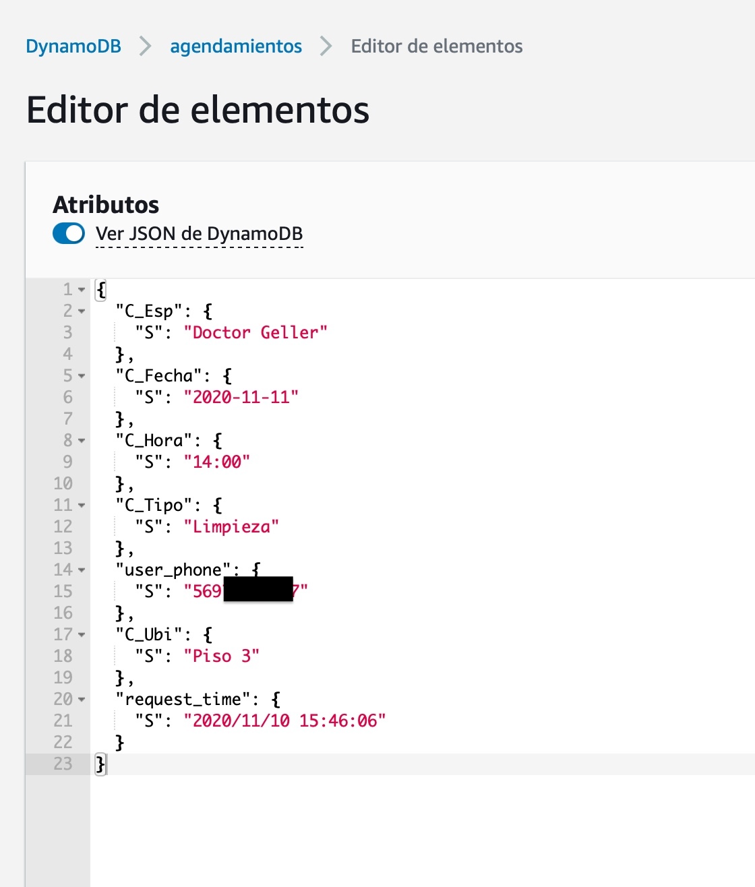

# Integración de Lex con mensajes de Whatsapp

Antes de continuar, asegúrese de haber realizado los pasos anteriores y confirmar que todo funciona y que el boto está agendando correctamente. 

## 1. Crear una cuenta gratuita de Twilio

Cree una cuenta de twilio gratuita en https://www.twilio.com/try-twilio para acceder al Sandbox de Whatsapp

**Activar Whatsapp Sandbox** 

1. Una vez que tienes la cuenta gratuita en Twilio creada, va a el ícono con los 3 puntitos a la izquierda y selecciona Programmable Messaging.

    

2. Ir a la opción Try it Out -> Try WhatsApp
3. Tiene que agregar a sus contactos en el smartphone el número que indica Twilio en pantalla y enviar un mensaje desde su WhatsApp de acuerdo al código indicado en la pantalla (en la imagen para el caso caso decía "join darkness-question"). Una vez hecho esto debe seguir el resto de pasos para dejar pre configurado el ambiente. 

    

Una vez activado el sandbox deberá enrolar usuarios enviando un mensaje personalizado a el número de whatsapp provisto por twilio.

## 2. Twilio account SID y AUTH Token
 
Una vez activado el sandbox vaya a [consola twilio](https://www.twilio.com/console) y tome nota de de **ACCOUNT SID** y **AUTH TOKEN**

## 3. Lex endopoint url de Twilio channel

Volviendo a la [consola de Lex](https://console.aws.amazon.com/lex/home) realizamos la publicación de una una versió. Esto nos permite utilizar un endpoint para los canales de integración (en este caso twilio)

Una vez publicdo el bot, en la pestaña channels -> Twilio SMS configuramos un nuevo canal:

* Account SID: **ACCOUNT SID**  de twilio
* Authentication Token: **AUTH TOKEN** de twilio

Cuando lo activamos nos genera un **Endpoint URL** de invocación, lo copiamos para incorporarlo en la consola de twilio.

Y lo pegamos en la url a llamar cuando llegue un mensaje:

Guardamos en twilio y ya está listo, ahora probemos.

## 4. Pruebas end to end.

Para probar el bot de agendamiento agregamos como contacto el número asignado por twilio y enviamos el mensaje de **Opt-in**, una vez enrolado ya estamos listos para utilizar:

Adicionalmente como parte del despliegue podemos acceder a la url que muestra las agendas realizads por whatsapp. 

También podemos ver que un registro se ha insertado en la base de datos, ahora trae los datos del usuario que realizó la cita:

### **[Volver al proyecto ↩️ ](README.md)**