# Integración de Lex con notas de Voz de Whatsapp

Antes de continuar, asegúrese de haber realizado los pasos anteriores y que la integración con Whatsapp está funcionando correctamente.

Nuestro bot tiene las capacidades de recibir audio, pero qué pasa cuando enviamos una nota de voz? En estos momentos Nuestro Bot no es capaz de procesar los mensajes multimedia que envía (twilio). Lo que tenemos que hacer es generar un nuevo endnoint que permita convertir los audios a un formato entendible por Lex.

## 1. Nueva Función Lambda

Creamos una nueva funcion con tiempo de ejecución Python 3.6

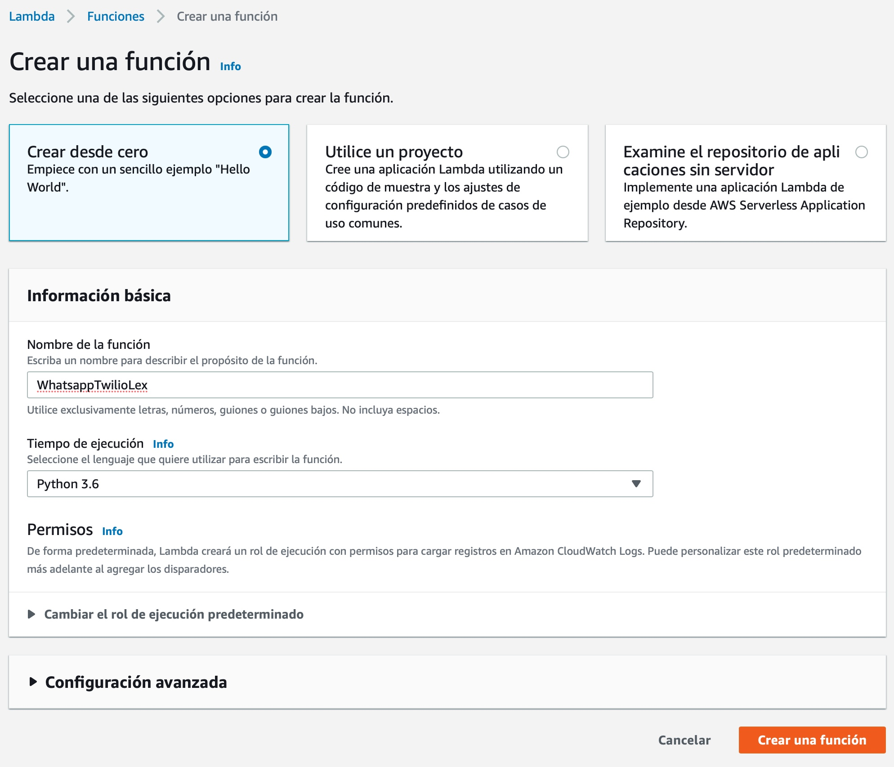


## 2. Librerías para Twilio y conversión de audio

El ambiente Lambda no cuenta nativa con el SDK de Twilio ni tampoco tiene soporte para CODECS de audio.  Lo que vamos hacer en este paso es agregar un par de capas que nos permitirán importar estas librerías en la función. Vamos a la consola lambda en la barra lateral seleccionamos **layers** o **capas**.

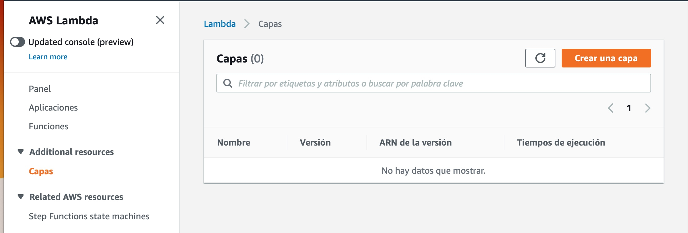

Seleccionamos **Crear Capa** 

* Nombre : **twilio**
* Tiempo de ejecución: **Python 3.6 y 3.7**
* Archivo: **[twilio.zip](lambda/layers/twilio.zip)**

_En caso de tener algún problema para descargar o subir el archivo utilice la alternativa archivo S3: s3://ensamblador-public-layers-us-east-1/twilio.zip_


Luego click en **crear**

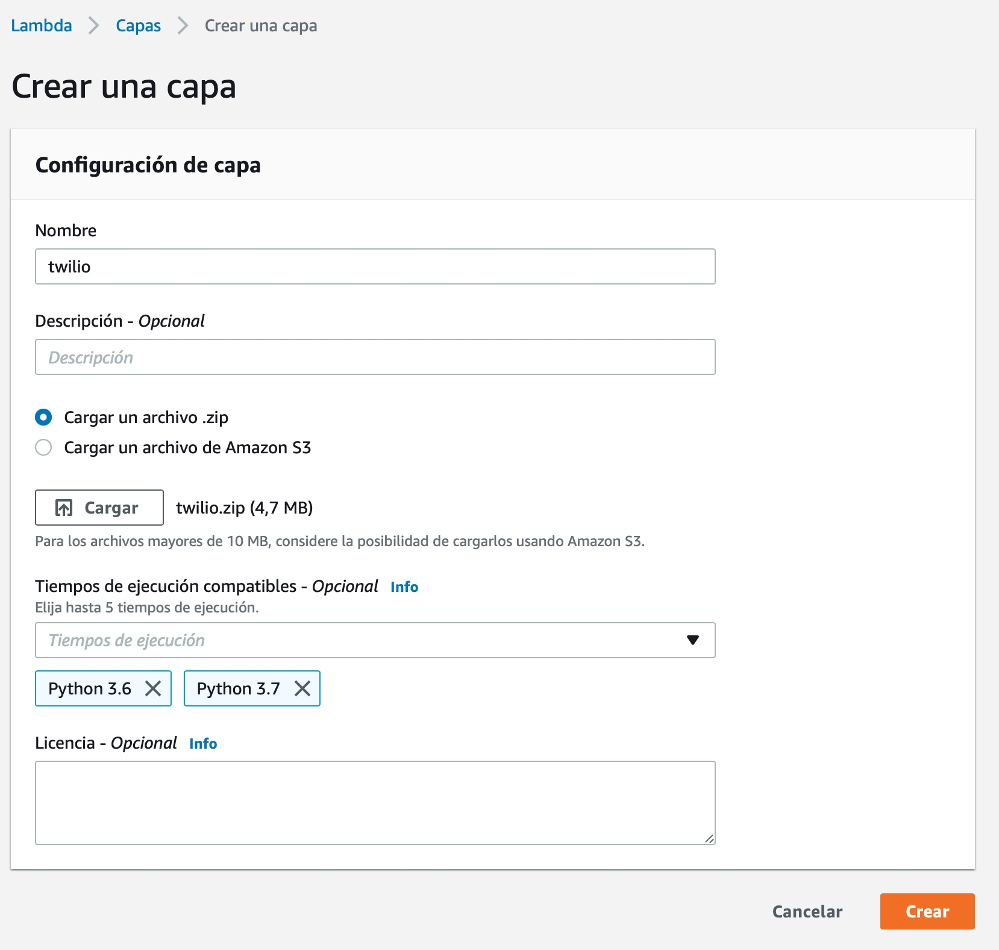

Para la capa ffmpeg es el mismo procedimiento

* Nombre : **ffmpeg**
* Tiempo de ejecución: **Python 3.6 y 3.7**
* Archivo: **[ffmpeg.zip](lambda/layers/ffmpeg.zip)**

_En caso de tener algún problema para descargar o subir el archivo utilice la alternativa archivo S3: s3://ensamblador-public-layers-us-east-1/ffmpeg.zip_


Al final las capas deberán quedar así:

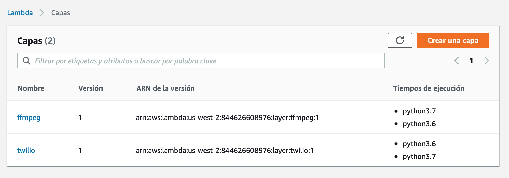


_Nota: Si quiere conocer el procedimiento para crear sus propias capas con librerías externas puede seguir el tutorial [Creating New AWS Lambda Layer For Python Pandas Library](https://medium.com/@qtangs/creating-new-aws-lambda-layer-for-python-pandas-library-348b126e9f3e)


Ahora en la funcion lambda que acabamos de crear vamos a incorporar las 2 capas que creamos.

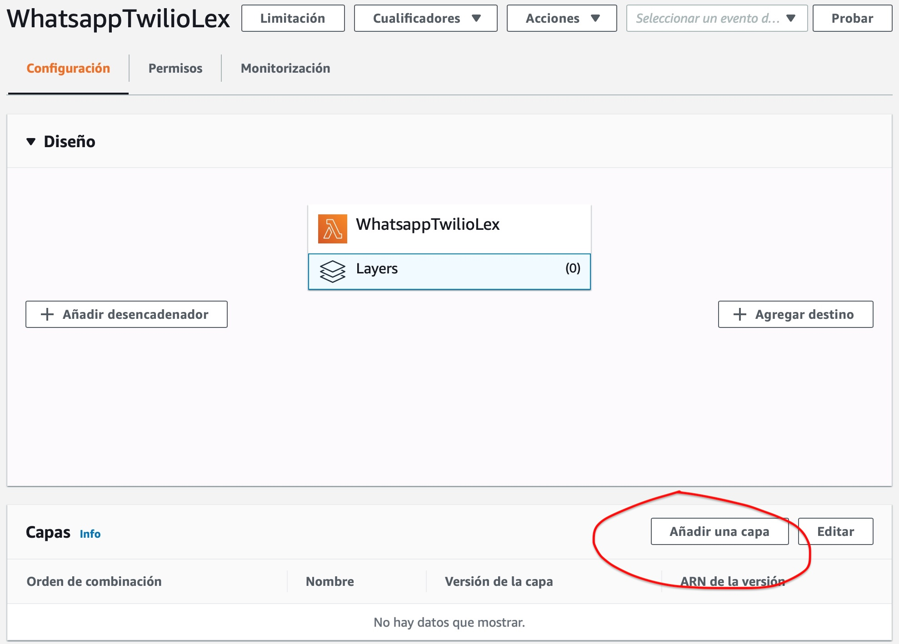

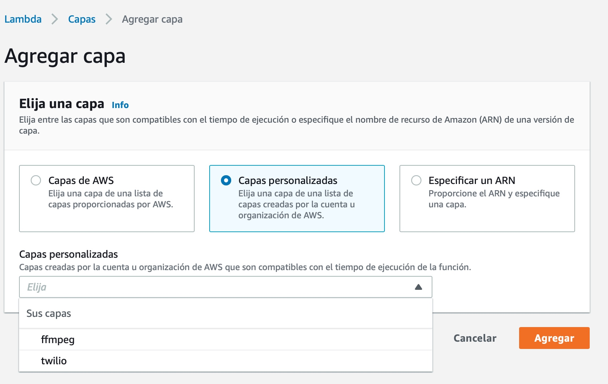

Las capas deberían quedar incorporadas en la función y ya las podemos utilizar
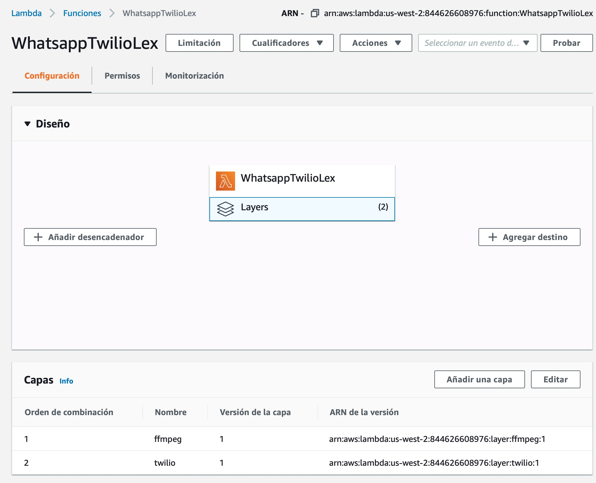


## 3. Configurar Timeout y Memoria
 
 Vamos a configurar inicialmente una memoria de 512MB y un tiempo de espera de 20 segundos.

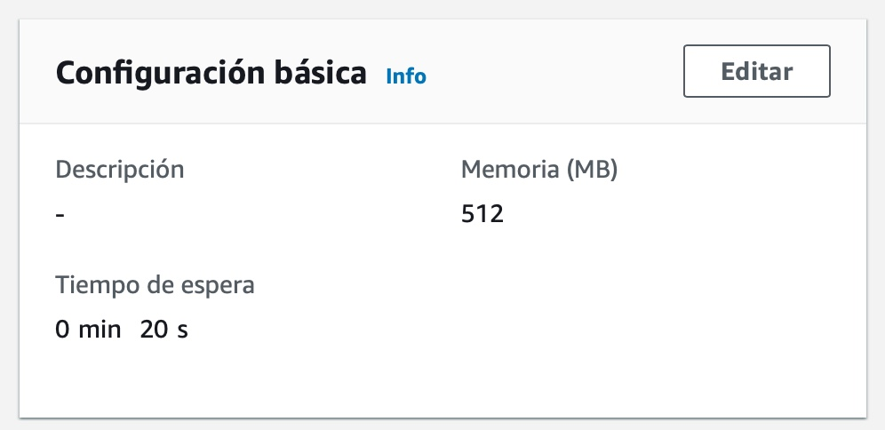

## 4. Codigo de la funcion 

Copiar y pegar el código a continuación, se encuentra comentado para explicar lo que hace en cada método.

Recuerde reemplazar el nombre de su bot en esta línea

# 👇
```python
# TO DO : Reemplace acá con el nombre de su Bot.
BOT_NAME = 'ScheduleAppointment_Workshop_Demo'
```


Código completo de la función:


```python
import json
import os
import subprocess
import uuid
import stat
import shutil
import boto3
import datetime
from twilio.twiml.messaging_response import Body, Message, Redirect, MessagingResponse
import urllib
from botocore.vendored import requests

import boto3
client = boto3.client('lex-runtime')

lambda_tmp_dir = '/tmp' # La funcion puede escribir solo en este dir
local_source_audio = "{0}/downloaded".format(lambda_tmp_dir)
output_file = "{0}/output.wav".format(lambda_tmp_dir)
botAlias ='$LATEST'  #Nuestro BOT cambiar si le pusimos otro nombre

# TO DO : Reemplace acá con el nombre de su Bot.
BOT_NAME = 'ScheduleAppointment_Workshop_Demo'

#Verificamos si estamos ejecutando en el ambiente Lambda o no
def is_lambda_runtime():
    return True if "LAMBDA_TASK_ROOT" in os.environ else False

#Si estamos en Lambda vamos a utilizar la carpeta /tmp
if is_lambda_runtime():
    # ffmpeg is stored with this script.
    # When executing ffmpeg, execute permission is requierd.
    # But Lambda source directory do not have permission to change it.
    # So move ffmpeg binary to `/tmp` and add permission.
    ffmpeg_bin = "{0}/ffmpeg.linux64".format(lambda_tmp_dir)
    shutil.copyfile('/opt/ffmpeg.linux64', ffmpeg_bin)
    os.environ['IMAGEIO_FFMPEG_EXE'] = ffmpeg_bin
    os.chmod(ffmpeg_bin, os.stat(ffmpeg_bin).st_mode | stat.S_IEXEC)
    

def lambda_handler(event, context):

    log_banner('Log de Ejecución')
    body = urllib.parse.parse_qs(event["body"])
    #print('body: {}'.format(json.dumps(body)))
    response = MessagingResponse()
    message = Message()
    
    #Vemos si hay sesión activa (estamos en una conversación) o creamos una nueva.
    try:
        session = client.get_session(
            botName=BOT_NAME,
            botAlias=botAlias,
            userId=body['From'][0].replace(':','').replace('+','')
        )
        
    except Exception:
        session = client.put_session(
            botName=BOT_NAME,
            botAlias=botAlias,
            userId=body['From'][0].replace(':','').replace('+','')
        )
    
    print (session)
    
    #Si en el request viene el campo Body significa que es una solicitud de texto e invocamos la respuesta de Lex
    if "Body" in body:
        lex_response = client.post_text(
            botName=BOT_NAME,
            botAlias=botAlias,
            userId=body['From'][0].replace(':','').replace('+',''),
            inputText=body['Body'][0]
        )
        print (lex_response)
        message.body(lex_response['message'])

    #Si viene el campo MediaUrl0 significa que es una solicitud de audio 

    if "MediaUrl0" in body:
        download_audio(body['MediaUrl0'][0]) # Descargamos el audio a almacenamiento local
        transcode_audio() #lo transcodificamos a codec entendible por lex
        print ("start request")
    
        with open(output_file, 'rb') as file:
            binary_file = file.read()

        #Invocamos post_content de lex pasando el stream transcodificado
        response_content = client.post_content(
            botName=BOT_NAME,
            botAlias=botAlias,
            userId=body['From'][0].replace(':','').replace('+',''),
            accept='text/plain; charset=utf-8',
            contentType='audio/l16; rate=16000; channels=1',
            inputStream=binary_file
        )  
        print (response_content)
        message.body(response_content['message'])

    #Respondemos un objeto MessagingResponse() de twilio 
    response.append(message)

    return {
        'statusCode': 200,
        "headers": {
            "Content-Type": "text/html",
        },
        'body': str(response)
    }


def log_banner(text):
    banner_width = len(text)+8
    print (banner_width*'*')
    print ('*** {} ***'.format(text))
    print (banner_width*'*')
    
def download_audio(audio_url):
    resp = requests.get(audio_url)
    download_to = local_source_audio
    if resp.status_code==200:
        with open(download_to, "wb") as fh:
            fh.write(resp.content)
    output = subprocess.check_output(["file", local_source_audio ])
    print( str(output, "utf-8") )
    

def transcode_audio():
    print('start transcode_audio()')
    resp = subprocess.check_output([ffmpeg_bin, '-i', local_source_audio, '-vn', '-acodec', 'pcm_s16le', '-ar', '16000', '-y', output_file ])
    print( str(resp, "utf-8") )    
    print( str(subprocess.check_output(["file", output_file ]), "utf-8")  )

```

## 4. Permisos

Esta función requiere los permisos para invocar el Bot. Para eso vamos a modificar los permisos como lo hicimos en la función del anda de Fulfillment. En la función vamos a `permisos > rol de ejeción` y le damos click para ir a la consola IAM.


Ya en la consola editamos la política y agreamos los siguientes permisos:
* Servicio: **Lex**
* Acciones: **GetSession, PutSession, PostText, PostContent** (las llamadas a la API que hacemos en la función)
* Recurso: **Específico** Bot Alias
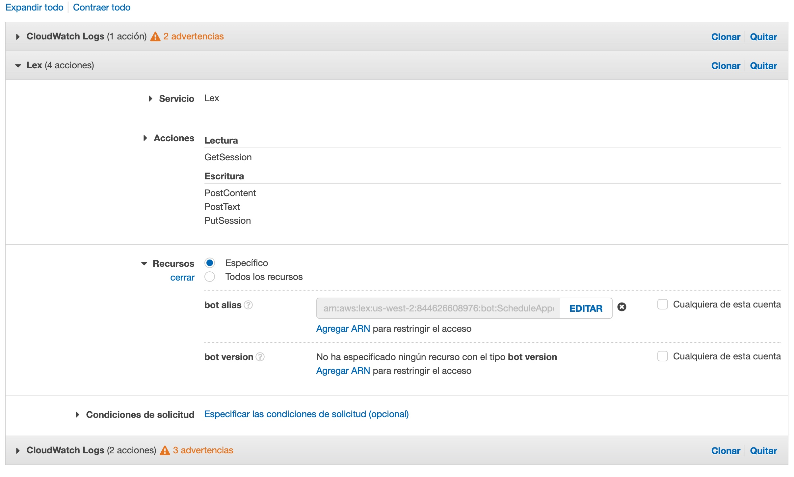
Para definir el ARN utilizamos los datos de nuestro Bot (* para todas las versiones del bot)


**Añadir -> Revisar y Guardar**

## 4. API de invocación (endpoint nuevo)

En este caso no podemos utilizar el mismo endpoint que nos proporciona lex para la integración con Twilio.
Debemos utilizar uno que permita invocar esta función Lambda nueva, para eso vamos a levantar una API con Amazon API Gateway.

En la consola de Lambda vamos a añadir un **nuevo desencadenador** API Gateway

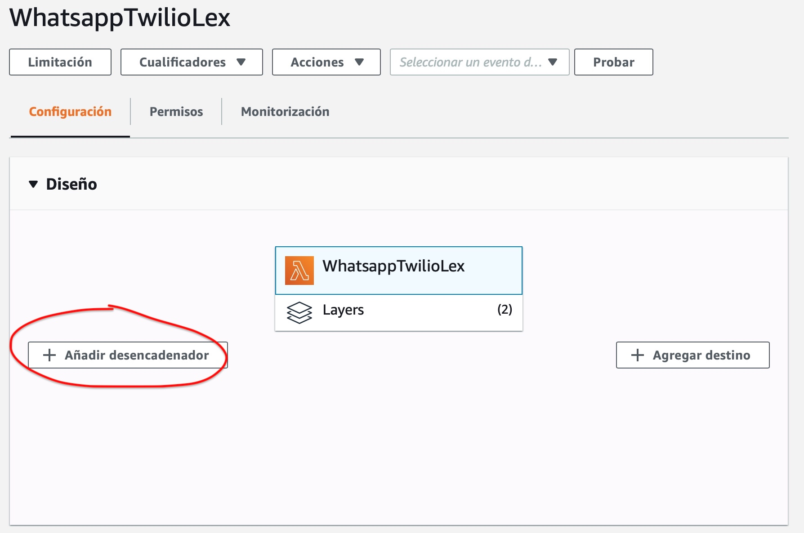

En este paso creamos una API para invocar la función desde la misma consola Lambda. Seleccionamos:
* API: **Crear una API**
* Tipo de API: **API de REST**
* Seguridad: **Abierta** (para la demo)

Click en **Agregar**
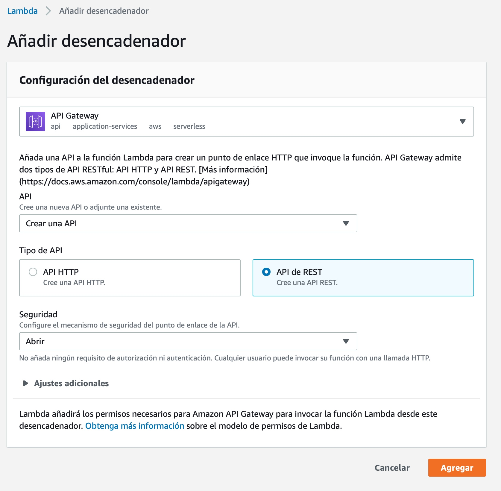

Una vez que esté generado revisamos el desencadenador y hacemos click en la API para ir a la consola de API Gateway.

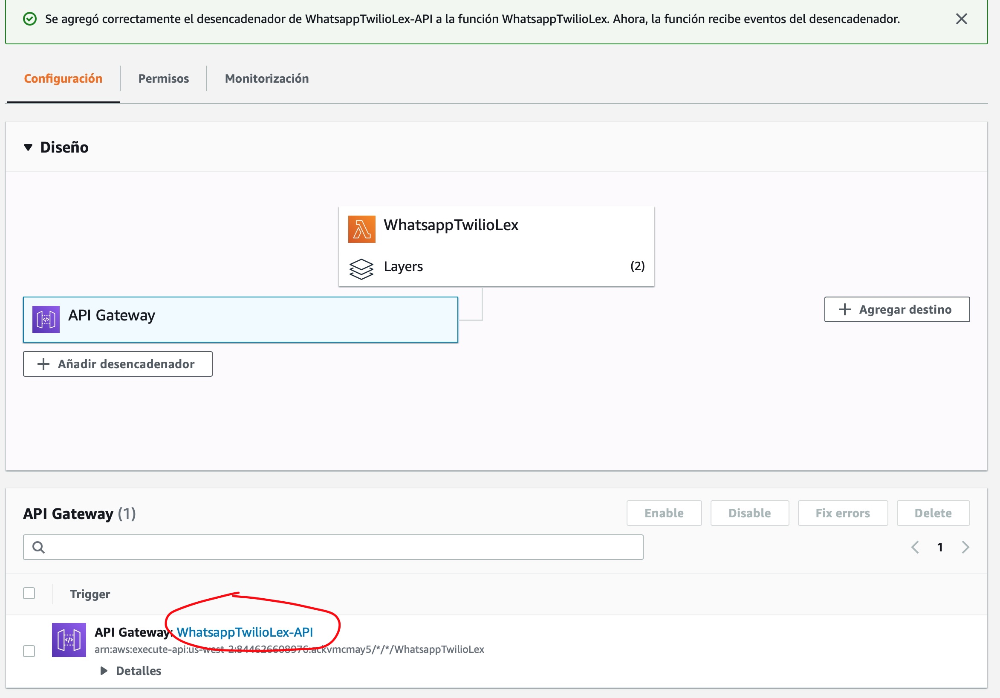

En la Consola API Gateway vemos que ya está creado la API llamada WhatsAppTwilioLex y que recibe cualquier tipo solicitud (GET, POST, PUT, OPTIONS, etc). En la integración hacia el Backend hay una función Landa. Que es la función que nosotros acabamos de crear.

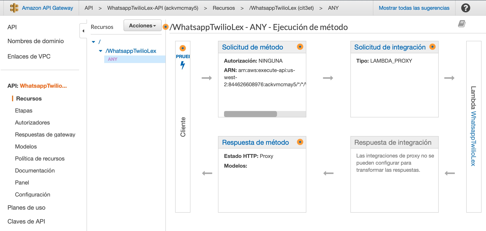

Nuestro nuevo en Point se encuentra en **`Etapas > default > WhatsAppTwilioLex > POST`**
Copiamos la URL que ahí aparece.
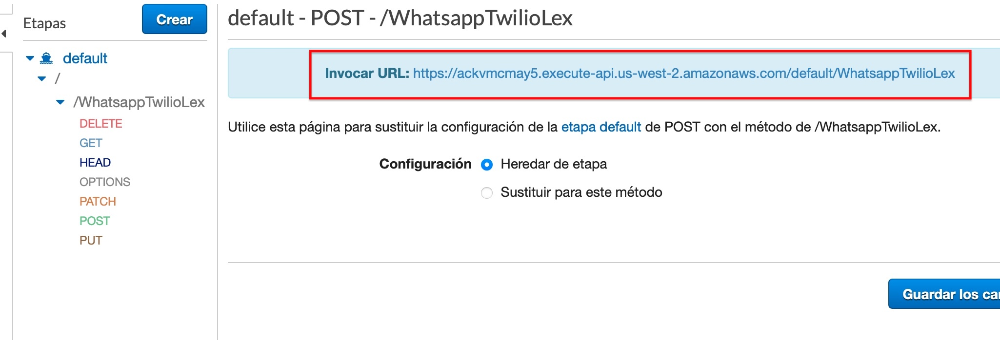

Ahora en la consola de Twilio reemplazamos el Endoint por la nueva URL.

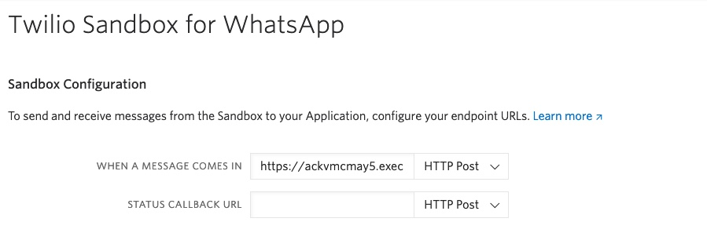

y damos click en **guardar**

Esperemos unos segundos y ya podemos enviar mensajes de audio de Whatsapp a nuestro bot.
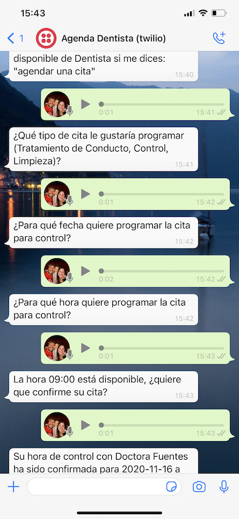


# 😎

### **[Volver al proyecto ↩️ ](README.md)**