# Función Lambda de Agendamiento

Con AWS Lambda, puede ejecutar código sin aprovisionar ni administrar servidores. Solo tiene que cargar el código y Lambda se encargará de todo lo necesario para ejecutar y escalar el código con alta disponibilidad. Esta función Lambda será la encargada de tomar el `Fulfillment`de Lex y convertirlo en una cita en la base de datos.

### 1. Primero vamos a la [consola de AWS Lambda](https://console.aws.amazon.com/lambda) y creamos una nueva función.

* Utilizamos **Crear desde cero**
* Nombre de la funcion: **FulFillmentLambda**
* Tiempo de ejecución: **Python 3.6 o 3.7**

Para el resto utilice la configuración por defecto y cree la nueva funcion.
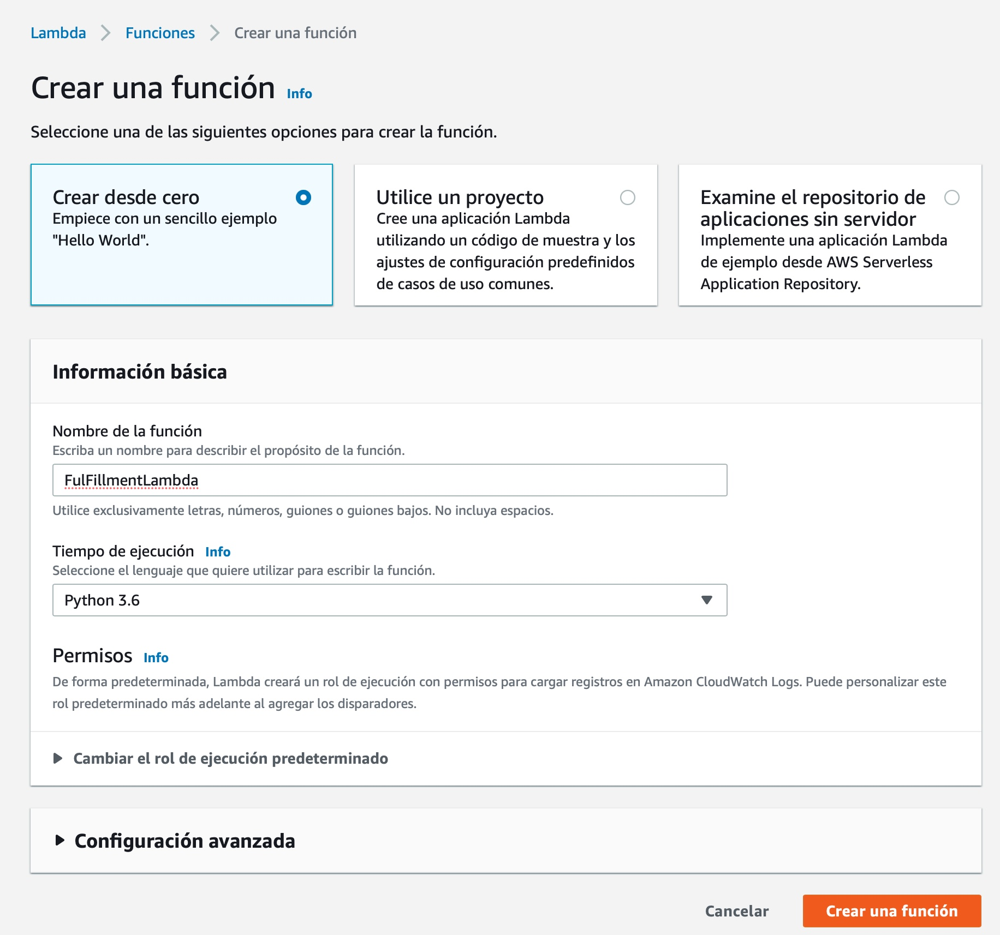

<br/><br/>
Una vez generada, en la pestaña `configuración` vamos a configurar la Memoria, Timeout y Variables de entorno.
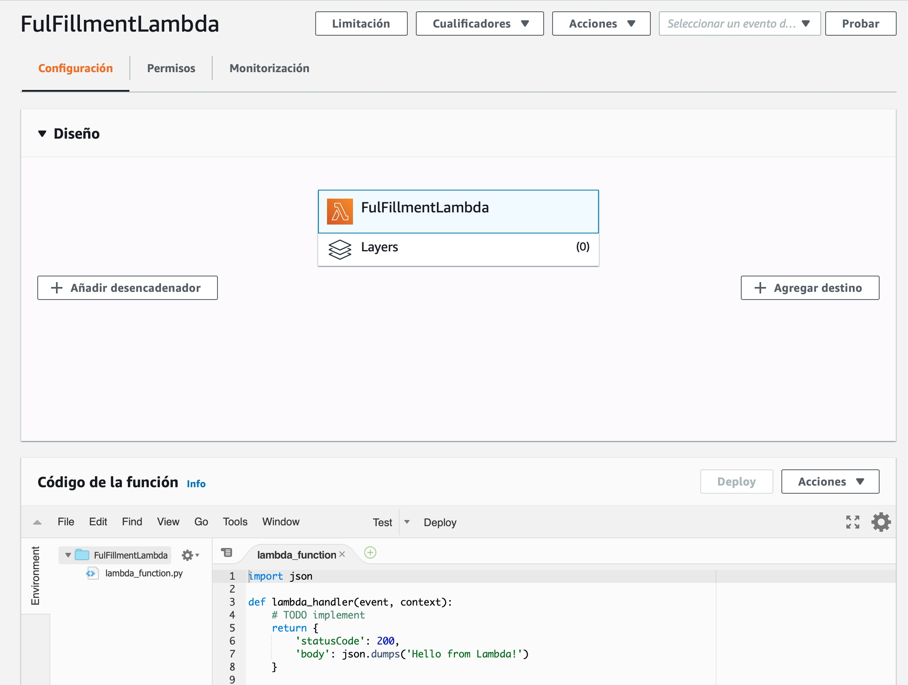

### 2. Agregamos como variable de entorno 
Vamos a **`configuración > Variables de entorno`**
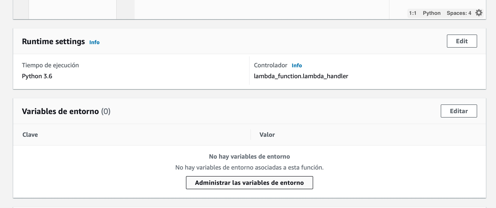
utilizamos:
* Clave: **APPOINTMENTS_TABLE**
* Valor: **agendamientos** (o el nombre que utilizó para crear la table en DynamoDB)

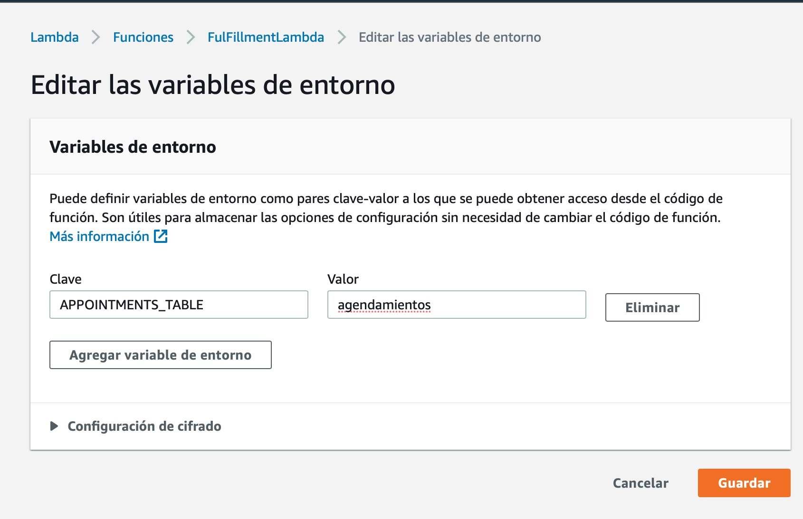
Click en **Guardar**

<br/><br/>

### 3. modificamos nuestra configuración de RAM Aprovisionada y timeout.
Vamos a  **`configuración > Configuración básica`**
* Memoria: **256MB**
* Tiempo de espera: **20s**

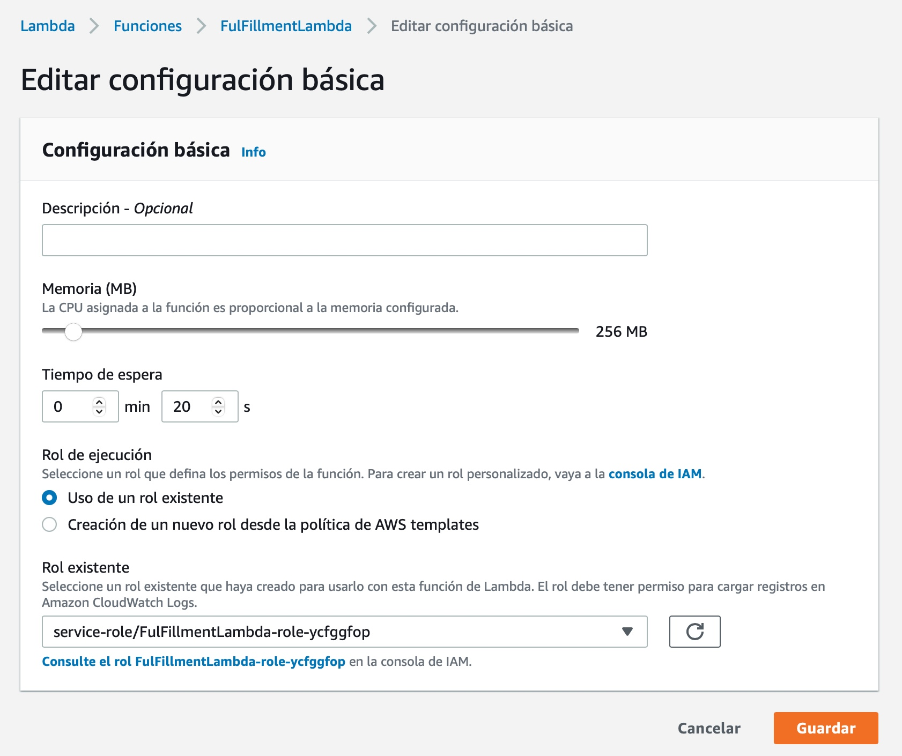
Click en **Guardar**

## 4. Modificamos los permisos del rol de ejecución.
Cuando creamos nuestra función Lambda, por defecto se crea un **rol de ejecución**, es decir una serie de permisos para las acciones que puede realizar esta función.

Nuestra función, además de la permisos básicos, debe ser capaz de escribir en nuestra base de datos por eso tenemos que agregar el permiso en la Consola de IAM (Identiy and Access Management)

Para ello vamos directamente a **`permisos > rol de ejecución`**, con un click accedemos a la consola de IAM para editar la politica del rol. 

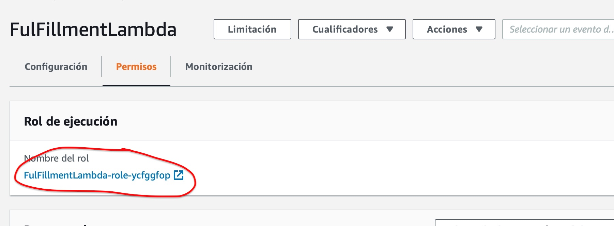

En la consola IAM, en los detalles del Rol, vamos a **Editar la política**

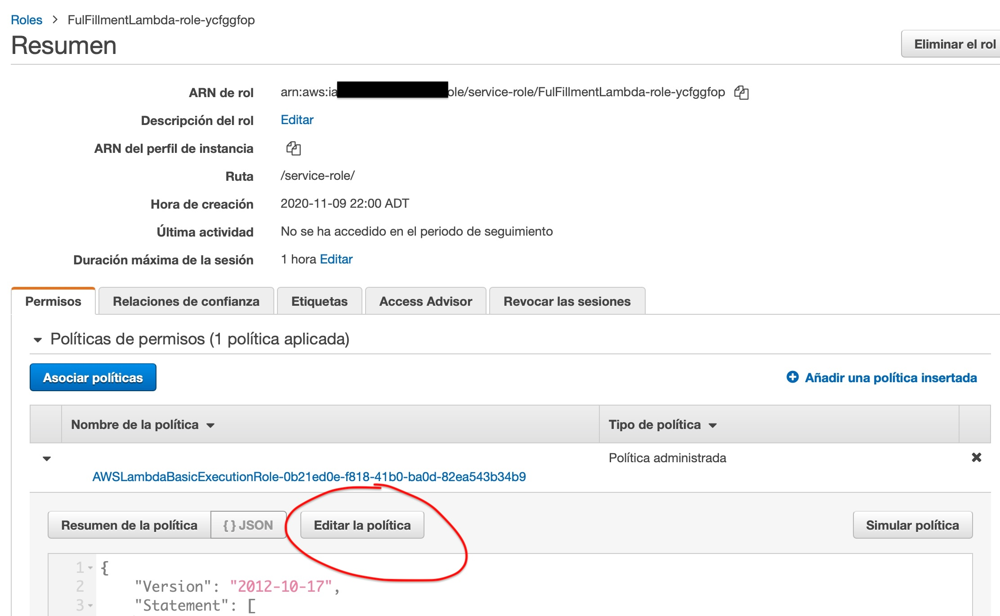

Luego **(+) Añadir Permisos Adicionales** 
 * Servicio: **DynamoDB**
 * Accion **Escritura PutItem**
 * Recursos **Table** y especificar el ARN de la tabla 

 El ARN aparece en la consola de DynamoDB sección inicial, de todas formas el esquema general del arn es

 `arn:aws:dynamodb:{region}:{cuenta aws}:table/{nombre de tabla}` 
 
 por ejemplo

 `arn:aws:dynamodb:us-west-2:123456789101:table/agendamientos`

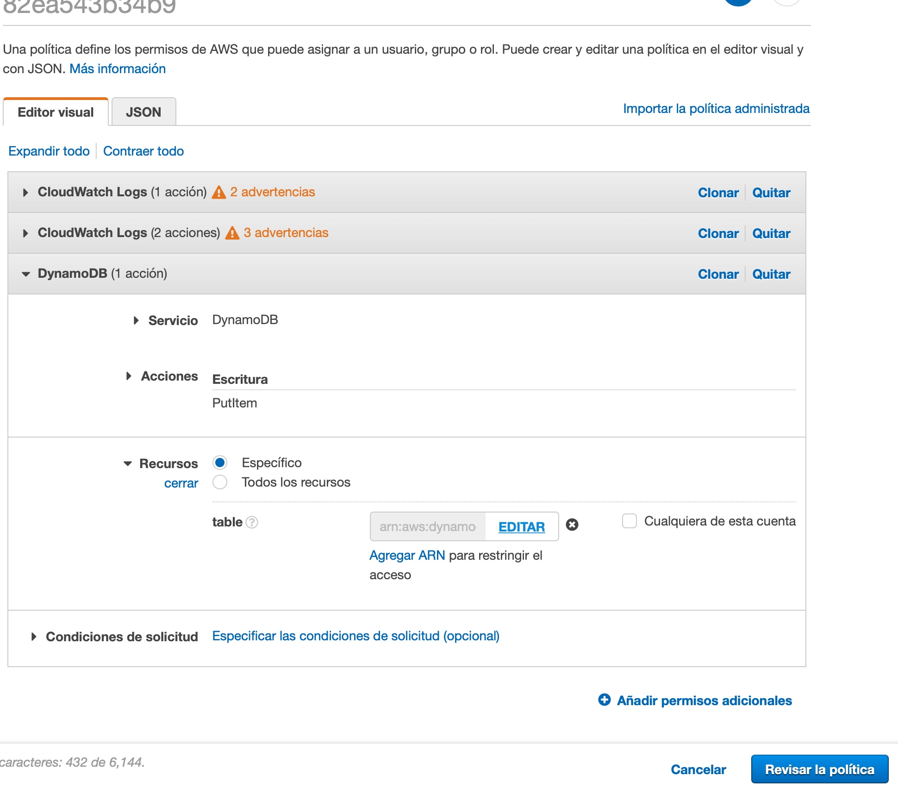

haga click en **Revisar la Política** y luego en **Guardar los Cambios**

## 5. Código de la función Lambda

El código que procesa nuestra solictud de agendamiento está a continuación, cópielo y péguelo en la consola de Lambda sección **código de la función**

```python
import logging
import json
import os
import random
import boto3
import datetime

logger = logging.getLogger()
logger.setLevel(logging.DEBUG)

#Inicialización del Objeto Tabla del SDK
ddb = boto3.resource('dynamodb') 
table = ddb.Table(os.environ["APPOINTMENTS_TABLE"])

#Esta funcion genera el objeto de respuesta
def close(session_attributes, fulfillment_state, message):
    response = {
        "sessionAttributes": session_attributes,
        "dialogAction": {
            "type": "Close",
            "fulfillmentState": fulfillment_state,
            "message": message,
        },
    }
    return response

#Crea la respuesta y envía el cierre de la Intención
def dispatch(appointment, session_attributes):
    resultado = "Su hora de {} con {} ha sido confirmada para {} a las {} Direccion: Andres Bello 1192 {}, Providencia".format(
        appointment["C_Tipo"],
        appointment["C_Esp"],
        appointment["C_Fecha"],
        appointment["C_Hora"],
        appointment["C_Ubi"]
    )

    return close (
        session_attributes,
        "Fulfilled",
        {"contentType": "CustomPayload", "content": resultado},
    )

#Crea una cita, acá debería estár la lógica del negocio de validación final.
def make_appointment(appointmen_info):
    doctores = ["Doctor Brown", "Doctora Rodríguez", "Doctora Fuentes", "Doctor Geller"]
    oficinas = ["Piso 5", "Piso 3", "Piso 9", "Piso 2"]
    appointmen_info["C_Esp"] = random.choice(doctores)
    appointmen_info["C_Ubi"] = random.choice(oficinas)
    return appointmen_info

# Guardado de la cita en la tabla DynamoDB
def save_appointment(event):
    request_time = datetime.datetime.now().strftime("%Y/%m/%d %H:%M:%S")
    request_attributes = request_attributes = event["requestAttributes"] if "requestAttributes" in event else None 

    #si es desde el sitio web
    if request_attributes is None:
       request_attributes =  {"x-amz-lex:twilio-target-phone-number": "none :console"}
       event['userId'] = 'console:'+event['userId']
    
    
    #si es desde facebook messenger
    if "x-amz-lex:twilio-target-phone-number" not in request_attributes:
        print (request_attributes)
        request_attributes[ "x-amz-lex:twilio-target-phone-number"] = "none: messenger"
        event['userId'] = 'console:'+event['userId']

        
    user_id = event["userId"].split(":")
    target_id = request_attributes["x-amz-lex:twilio-target-phone-number"].split(":")

    target_phone = target_id[1]
    target_channel = target_id[0]

    user_channel = user_id[0]
    user_phone = user_id[1]

    bot = event["bot"]

    appointment_type = event["currentIntent"]["slots"]["AppointmentType"]
    appointment_date = event["currentIntent"]["slots"]["Date"]
    appointment_time = event["currentIntent"]["slots"]["Time"]
    intent_name = event["currentIntent"]["name"]
    #sentiment = event["sentimentResponse"]["sentimentLabel"]

    appointment_info = {
        "request_time": request_time,
        #"user_channel": user_channel,
        "user_phone": user_phone,
        #"target_channel": target_channel,
        #"target_phone": target_phone,
        #"bot": bot,
        #"intent_name": intent_name,
        "C_Tipo": appointment_type,
        "C_Fecha": appointment_date,
        "C_Hora": appointment_time,
        #"sentiment": sentiment,
    }

    appointment_info = make_appointment(appointment_info)
    save_item_ddb(appointment_info)
    return appointment_info

#Put Item en DDB
def save_item_ddb(item):
    response = table.put_item(Item=item)
    return response

# Punto de entrada de la Función, el objeto evento trae los datos del fulfillment
def lambda_handler(event, context):
    print(event)
    appointment_info = save_appointment(event)
    respon  =dispatch(appointment_info, event['sessionAttributes'])
    print (respon)
    return respon

```
Le damos al boton **Deploy** para guardar el código y desplegar la función.

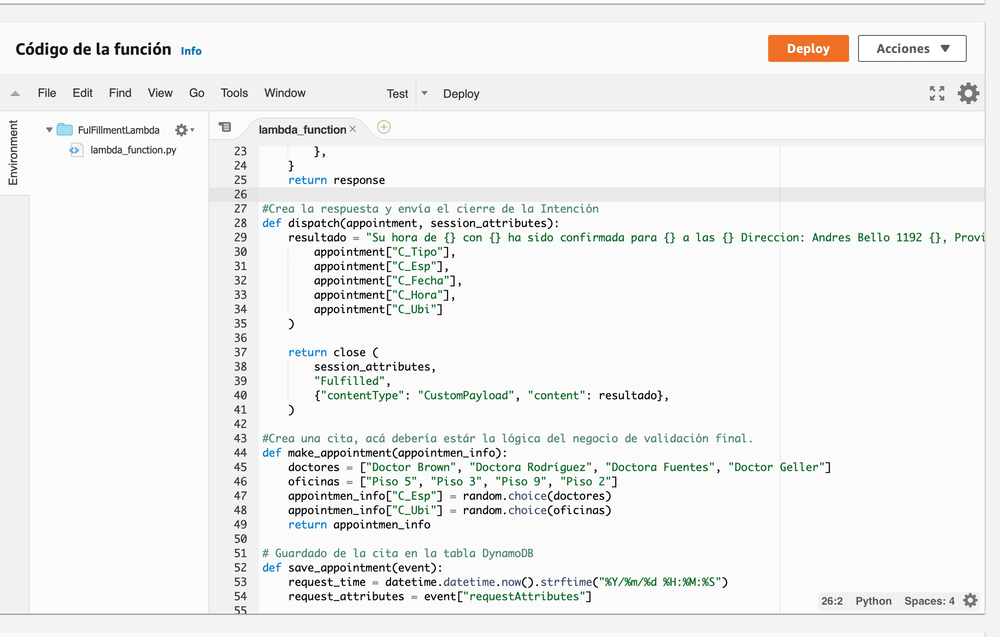


## 6. Probar la función funcionando OK

Para probar nuestra función, lo que vamos a hacer es crear un evento de prueba simulando un Fulfillment de Lex. 

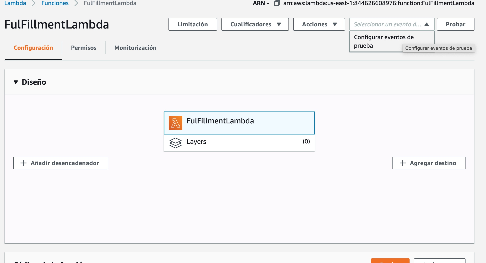

Buscamos un evento tipo Lex `MakeAppointment` y lo seleccionamos. Utilizamos el templete que nos propone.

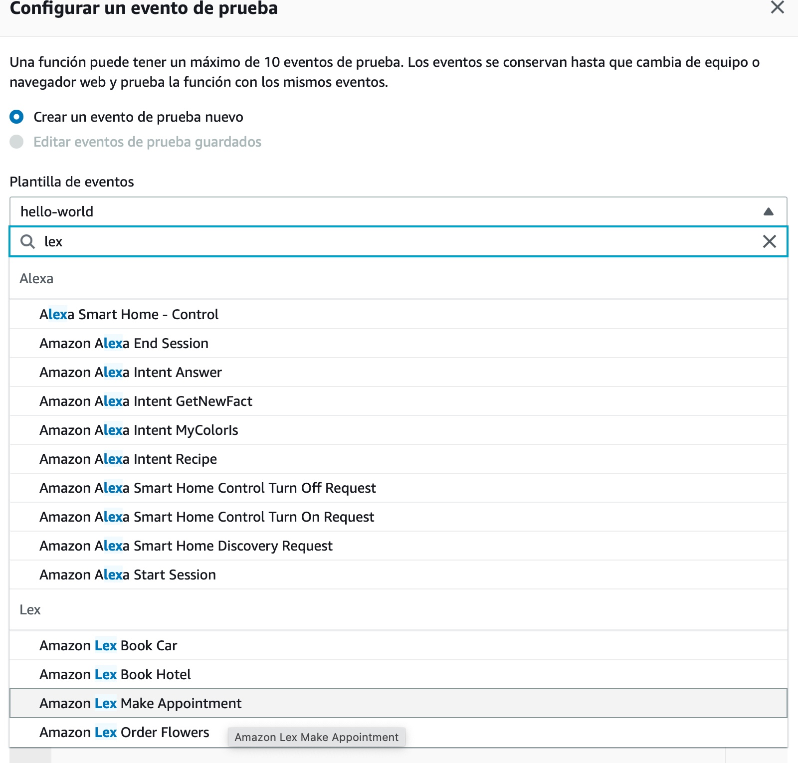

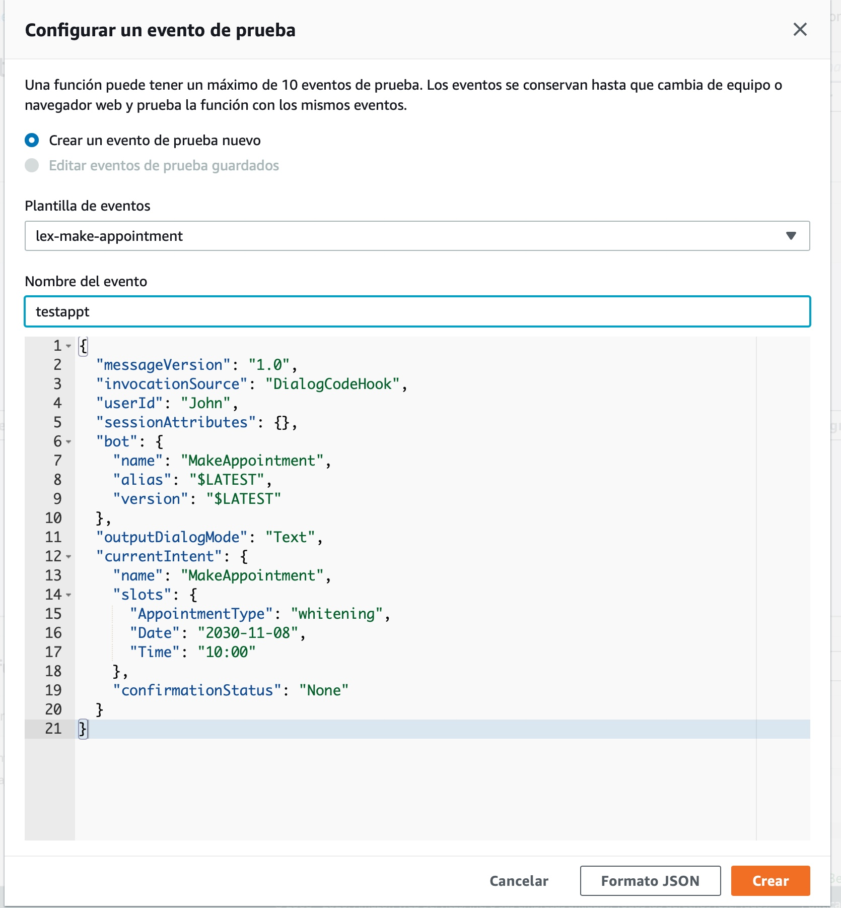

Le damos un nombre al evento y lo guardamos. Y finalmente utilizamos ese defecto para **probar** la función.

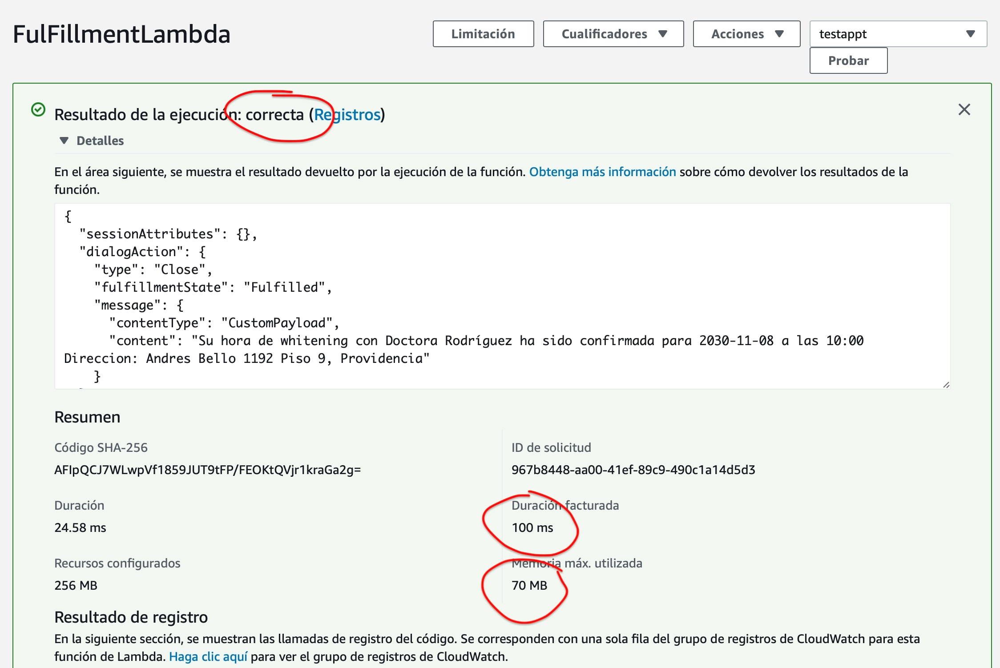

La función se ha ejecutado de forma correcta. Podemos también ver el uso de memoria el tiempo que le tomó la función en ejecutar. De hecho podemos ir a ver nuestra tabla de ayuntamientos y veremos el registro nuevo insertado.

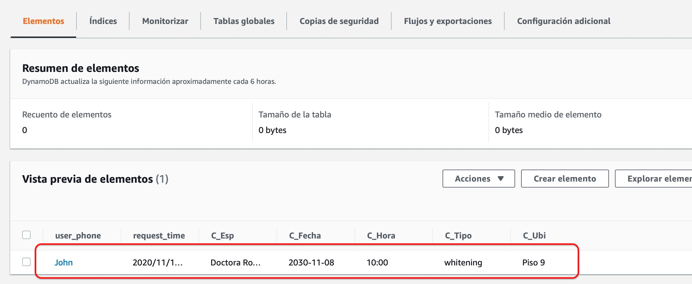
<br/><br/><br/>

## Listo! nuestra función ya está creada y podemos continuar con el resto del proyecto.
<br/>

### **[Volver al proyecto ↩️ ](README.md)**