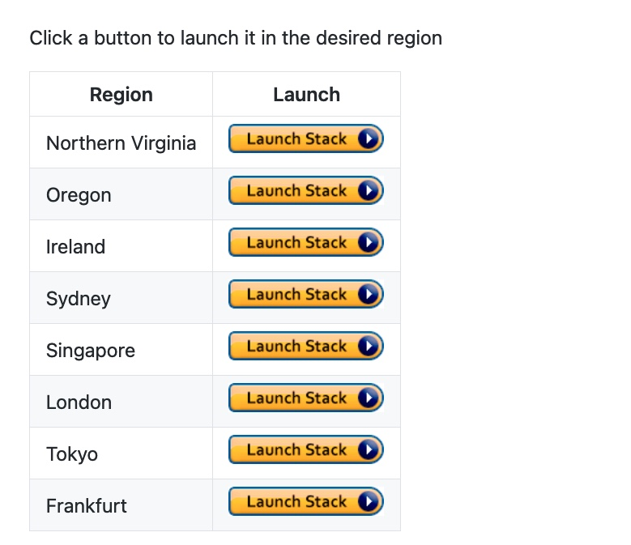
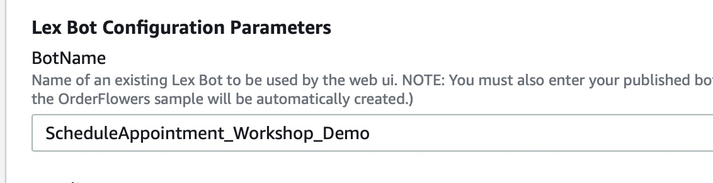
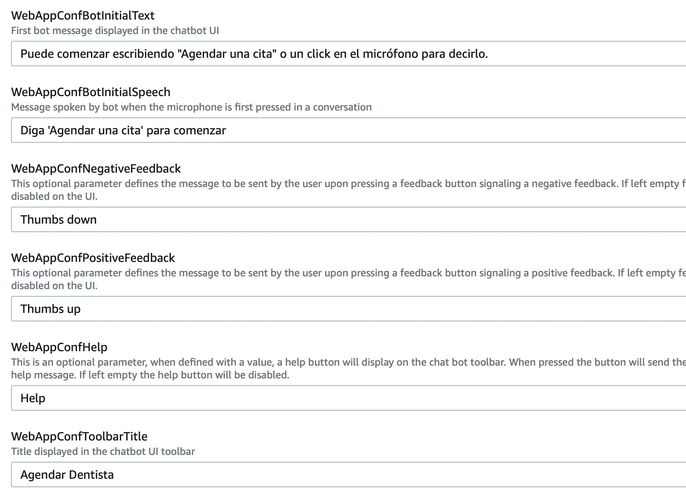
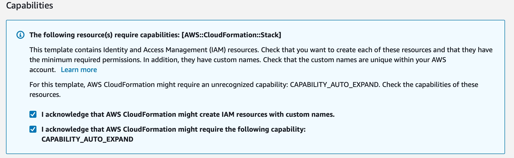
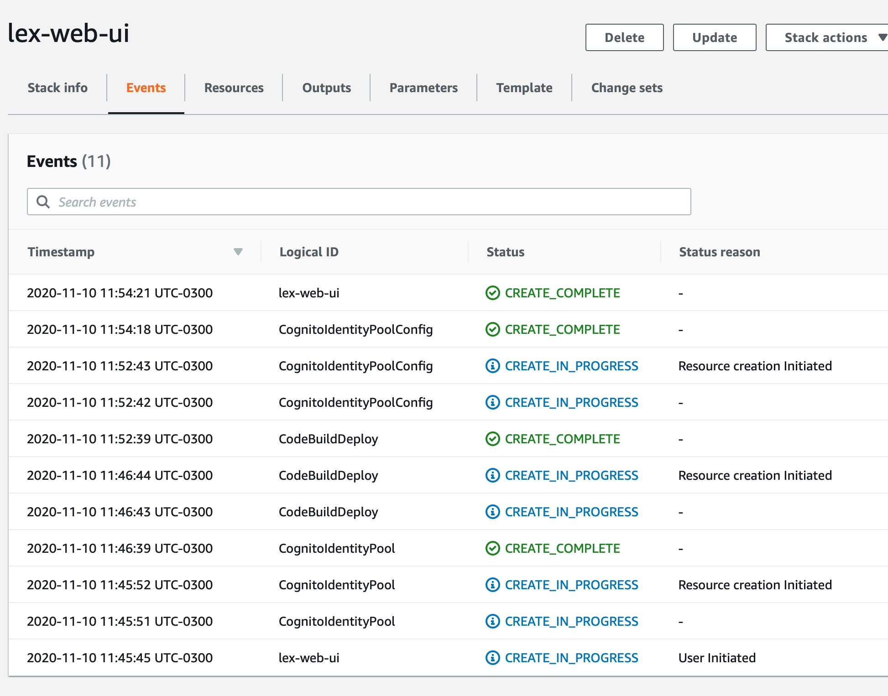
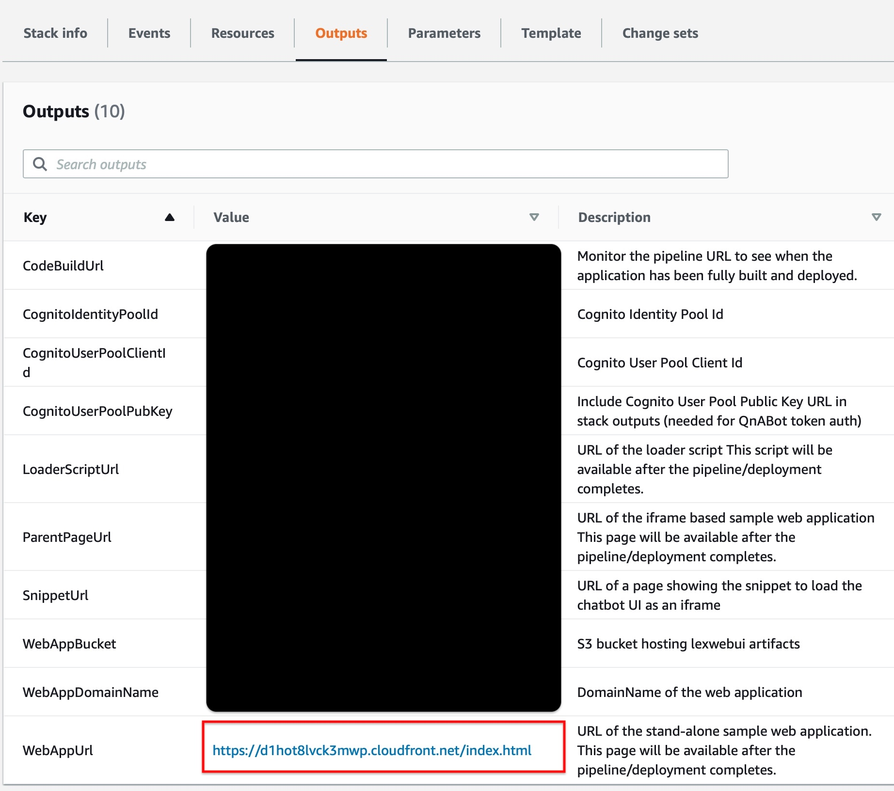
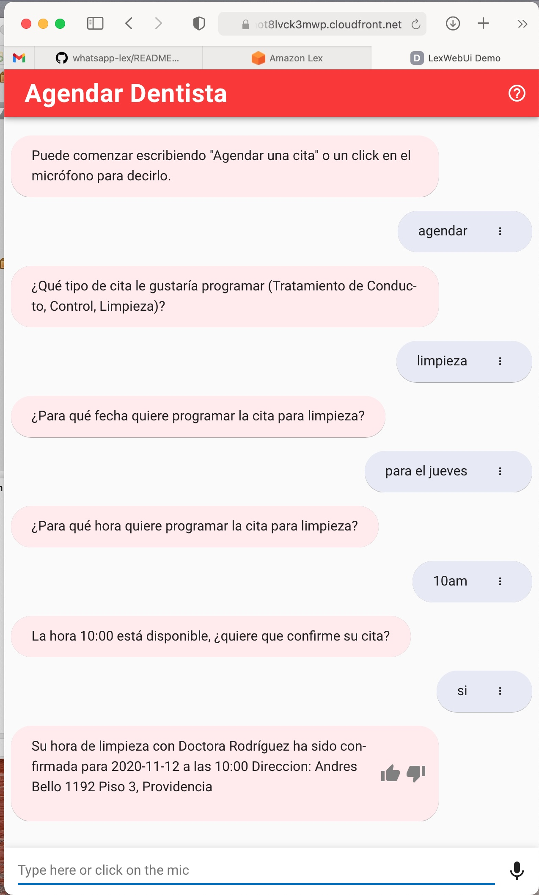
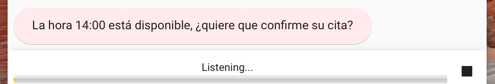

# Creación de una interfaz de usuario para interactuar con el Chatbot

Nuestro Bot de agendamientos ya está listo y funcionando completamente, puede ser utilizado a través de integraciones nativas como Facebook, Twilio, Kik y Slack. No obstante, no cuenta con una interfaz web que permita interactuar directamente con el. Para esto vamos a utilizar un despliegue de un-click para levantar un website que interactúe con el Bot. Vaya al repositorio y siga las instrucciones para el despligue en la región donde se ecuentra su Bot.

### [https://github.com/aws-samples/aws-lex-web-ui](https://github.com/aws-samples/aws-lex-web-ui)

Antes de desplegar el stack vamos a modificar los siguiente parámetros 

* BotName: **ScheduleAppointment_Workshop_Demo** (es el nombre del bot que utilizamos en el proyecto)
* WebAppConfBotInitialText: **Puede comenzar escribiendo "Agendar una cita" o un click en el micrófono para decirlo.**
* WebAppConfBotInitialSpeech **Diga 'Agendar una cita' para comenzar**
* WebAppConfToolbarTitle: **Agendar Dentista**

Aceptamos las capacidades del Stack.

A cloudformation le toma unos 10 minutos desplegar el stack completo. Una vez desplegado vamos a la pestaña outputs para obtener el link al chatbot web.

Accediendo a la web ya podemos conversar con el chatbot.

Acá también podemos utilizar el audio del micrófono para comunicarnos, el chatbot a su vez responderá con audios para dialogar sólo usando la voz. Para ello debemos hacer click en el botón del micrófono.

La interfaz web ya está completa, incluso es posible itegrarla en un sitio web accediendo al snippet url de los output de cloudformation.

### **[Volver al proyecto ↩️ ](README_Step_by_Step.md)**